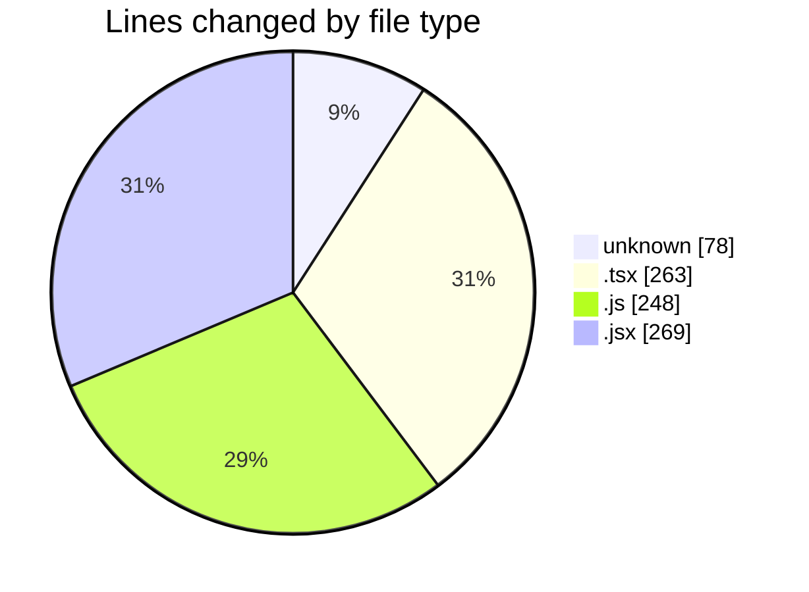
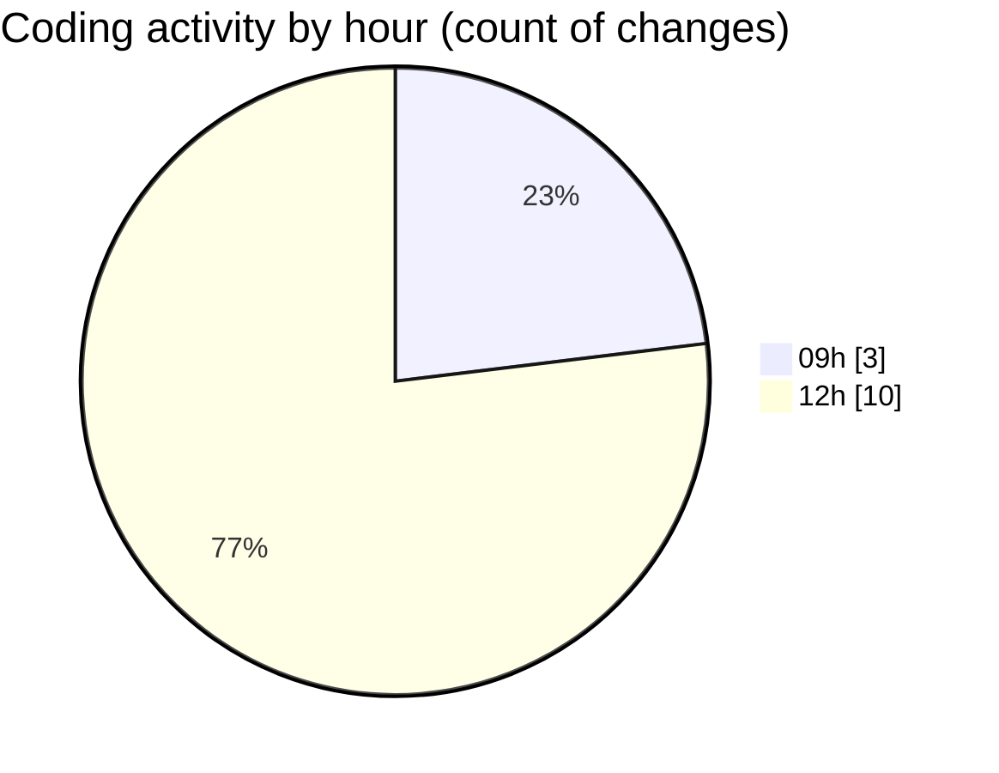

# cda - Activity Summary 

## Overall Statistics

| Stat                   | Value                                                             |
| ---------------------- | ----------------------------------------------------------------- |
| **Lines Added** (➕)   | 854                                          |
| **Lines Removed** (➖) | 4                                        |
| **Net Change** (↕)    | 850                |
| **Active Time** (⌚)   | 14 minutes |

## Modified Files
- **.env** (+78, -0)
- **App.tsx** (+204, -0)
- **EventCard.test.tsx** (+59, -0)
- **activityFeed.js** (+46, -0)
- **App.js** (+198, -4)
- **SkillTopic.jsx** (+269, -0)

## Visualizations

### By File Type (Lines Changed)

### By Hour (Estimated Activity Count)

> **Last Updated:** 02/06/2025, 12:59:59