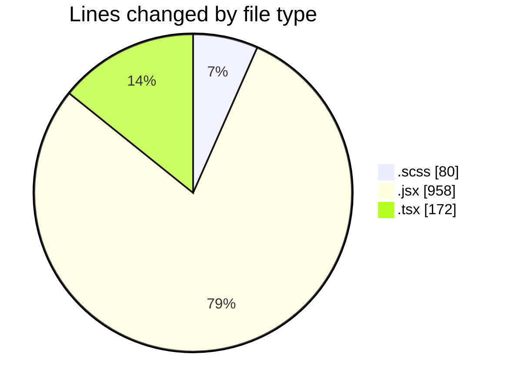
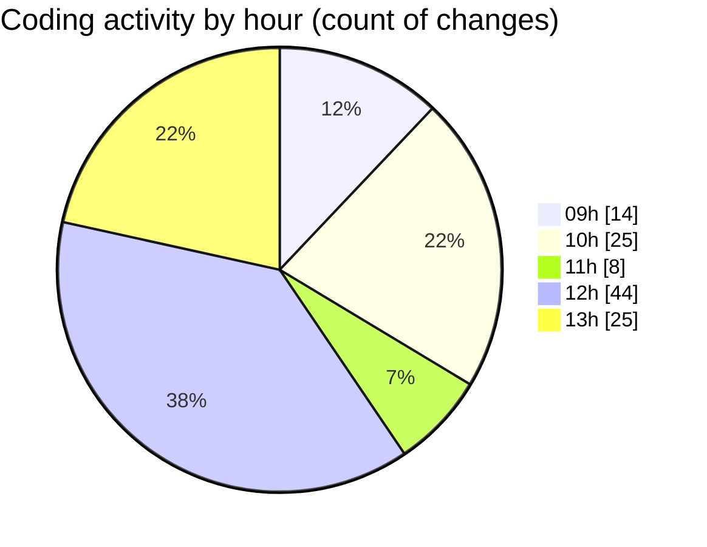

# cda - Activity Summary 

## Overall Statistics

| Stat                   | Value                                                             |
| ---------------------- | ----------------------------------------------------------------- |
| **Lines Added** (➕)   | 768                                          |
| **Lines Removed** (➖) | 442                                        |
| **Net Change** (↕)    | 326                |
| **Active Time** (⌚)   | 182 minutes |

## Modified Files
- **MarkdownEditor.scss** (+8, -0)
- **SkillTagModal.scss** (+64, -8)
- **SkillTagModal.jsx** (+471, -432)
- **PreferenceSkillTags.tsx** (+170, -2)
- **SubSkillOverview.jsx** (+55, -0)

## Visualizations

### By File Type (Lines Changed)

### By Hour (Estimated Activity Count)

> **Last Updated:** 03/06/2025, 13:39:26