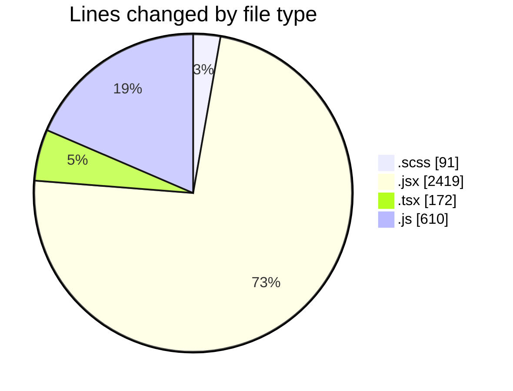
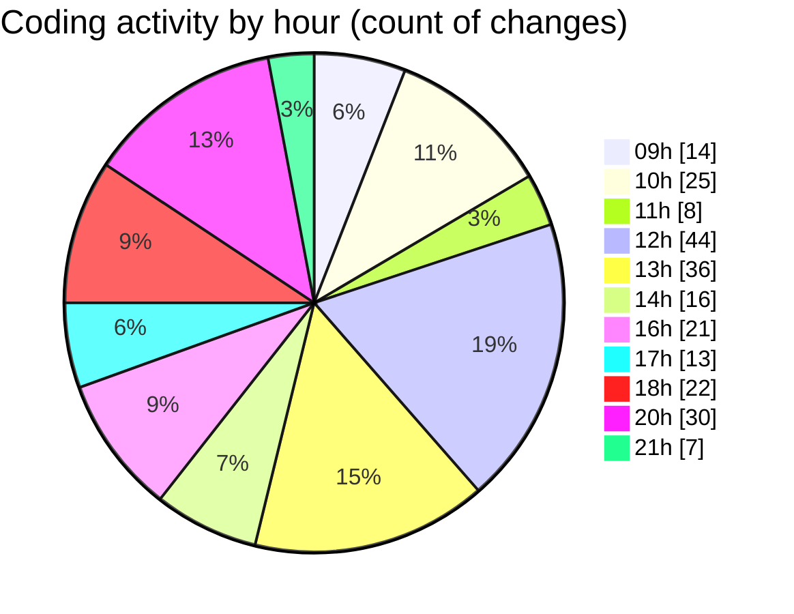

# cda - Activity Summary 

## Overall Statistics

| Stat                   | Value                                                             |
| ---------------------- | ----------------------------------------------------------------- |
| **Lines Added** (➕)   | 2281                                          |
| **Lines Removed** (➖) | 1011                                        |
| **Net Change** (↕)    | 1270                |
| **Active Time** (⌚)   | 364 minutes |

## Modified Files
- **MarkdownEditor.scss** (+8, -0)
- **SkillTagModal.scss** (+72, -11)
- **SkillTagModal.jsx** (+1085, -992)
- **PreferenceSkillTags.tsx** (+170, -2)
- **SubSkillOverview.jsx** (+55, -0)
- **mutations.js** (+604, -6)
- **SkillOverview.jsx** (+54, -0)
- **SubSkillTopic.jsx** (+233, -0)

## Visualizations

### By File Type (Lines Changed)

### By Hour (Estimated Activity Count)

> **Last Updated:** 03/06/2025, 21:09:26