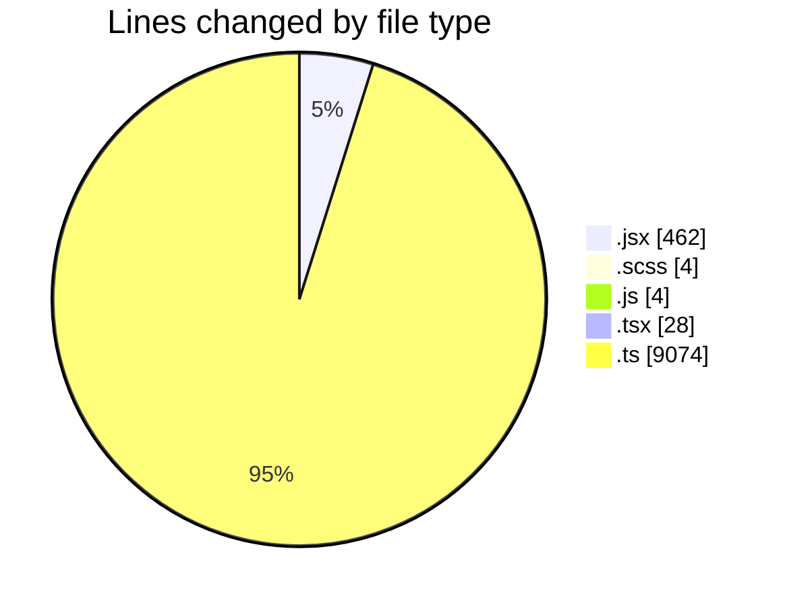
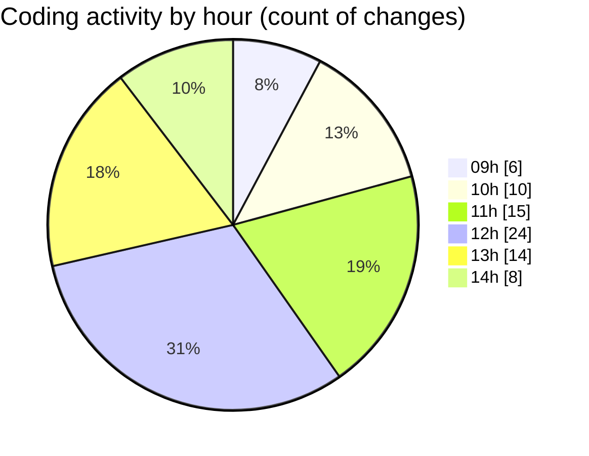

# cda - Activity Summary 

## Overall Statistics

| Stat                   | Value                                                             |
| ---------------------- | ----------------------------------------------------------------- |
| **Lines Added** (➕)   | 9344                                          |
| **Lines Removed** (➖) | 228                                        |
| **Net Change** (↕)    | 9116                |
| **Active Time** (⌚)   | 115 minutes |

## Modified Files
- **SkillTagModal.jsx** (+232, -211)
- **SkillTagModal.scss** (+0, -4)
- **SubSkillOverview.jsx** (+12, -7)
- **mutations.js** (+0, -4)
- **PreferenceSkillTags.tsx** (+26, -2)
- **graphql.ts** (+9074, -0)

## Visualizations

### By File Type (Lines Changed)

### By Hour (Estimated Activity Count)

> **Last Updated:** 04/06/2025, 14:09:28