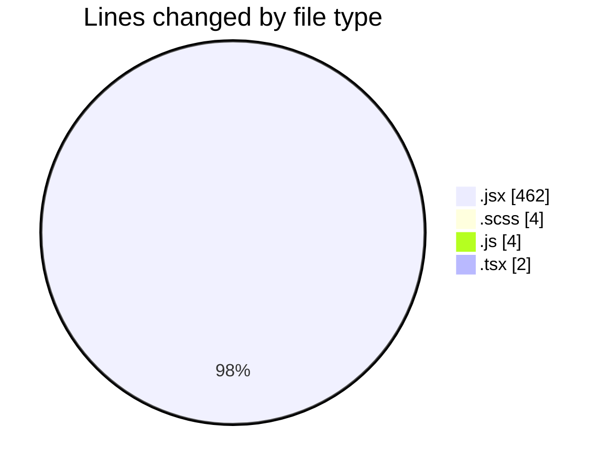
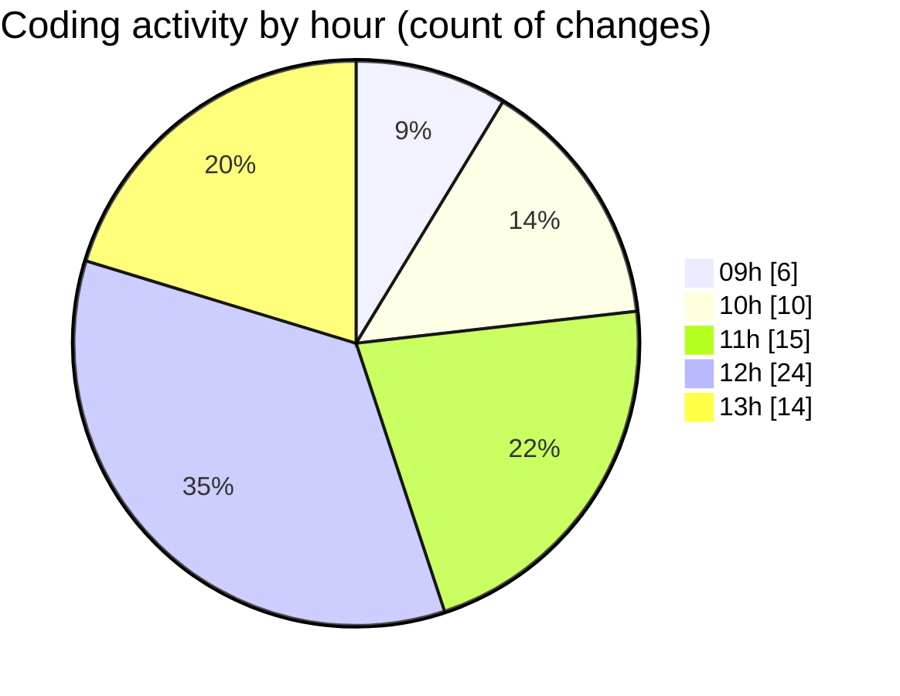

# cda - Activity Summary 

## Overall Statistics

| Stat                   | Value                                                             |
| ---------------------- | ----------------------------------------------------------------- |
| **Lines Added** (➕)   | 245                                          |
| **Lines Removed** (➖) | 227                                        |
| **Net Change** (↕)    | 18                |
| **Active Time** (⌚)   | 101 minutes |

## Modified Files
- **SkillTagModal.jsx** (+232, -211)
- **SkillTagModal.scss** (+0, -4)
- **SubSkillOverview.jsx** (+12, -7)
- **mutations.js** (+0, -4)
- **PreferenceSkillTags.tsx** (+1, -1)

## Visualizations

### By File Type (Lines Changed)

### By Hour (Estimated Activity Count)

> **Last Updated:** 04/06/2025, 13:54:28