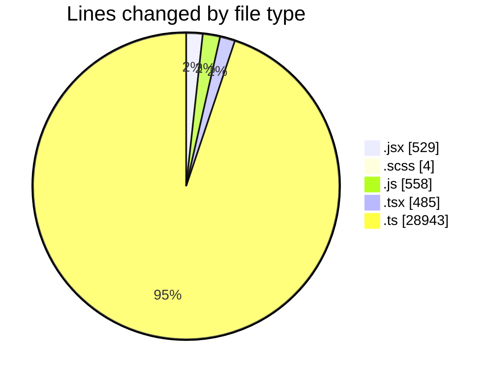
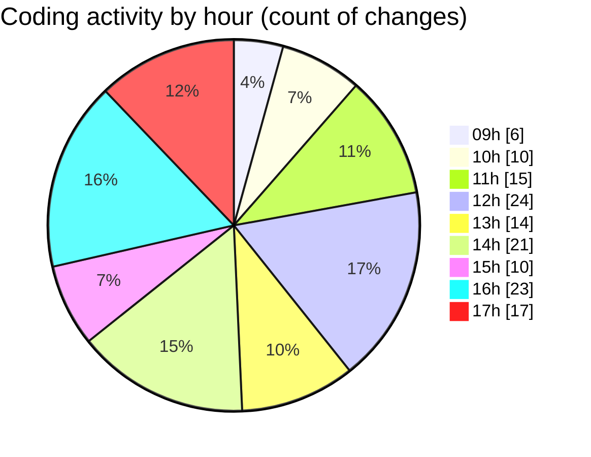

# cda - Activity Summary 

## Overall Statistics

| Stat                   | Value                                                             |
| ---------------------- | ----------------------------------------------------------------- |
| **Lines Added** (➕)   | 21799                                          |
| **Lines Removed** (➖) | 8720                                        |
| **Net Change** (↕)    | 13079                |
| **Active Time** (⌚)   | 203 minutes |

## Modified Files
- **SkillTagModal.jsx** (+277, -231)
- **SkillTagModal.scss** (+0, -4)
- **SubSkillOverview.jsx** (+12, -7)
- **mutations.js** (+0, -4)
- **PreferenceSkillTags.tsx** (+88, -66)
- **graphql.ts** (+13346, -8376)
- **SubSkillTopic.jsx** (+1, -1)
- **profile-hub.ts** (+1120, -27)
- **queries.js** (+550, -0)
- **gql.ts** (+82, -0)
- **graphql.ts** (+5992, -0)
- **App.js** (+0, -4)
- **SkillTag.test.tsx** (+47, -0)
- **PreferenceSkillTags.test.tsx** (+284, -0)

## Visualizations

### By File Type (Lines Changed)

### By Hour (Estimated Activity Count)

> **Last Updated:** 04/06/2025, 17:49:28