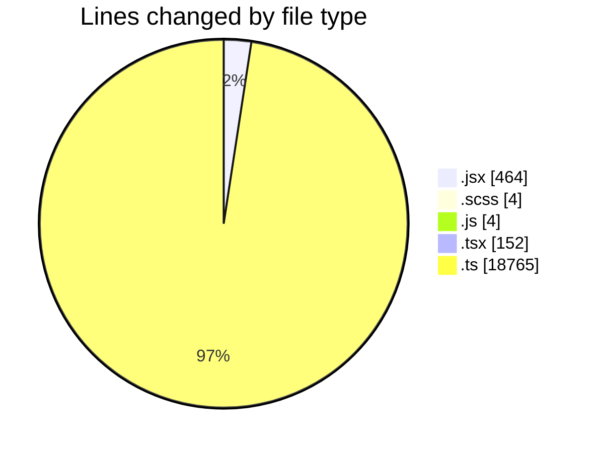
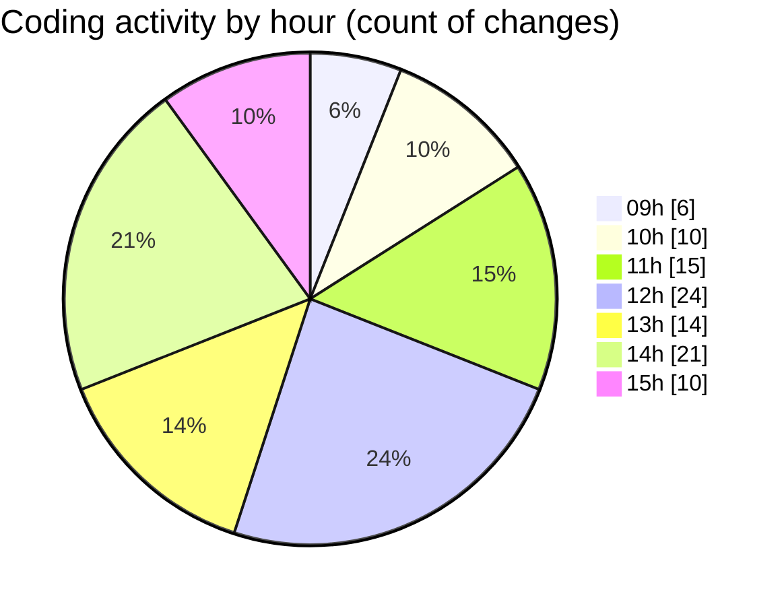

# cda - Activity Summary 

## Overall Statistics

| Stat                   | Value                                                             |
| ---------------------- | ----------------------------------------------------------------- |
| **Lines Added** (➕)   | 14798                                          |
| **Lines Removed** (➖) | 4591                                        |
| **Net Change** (↕)    | 10207                |
| **Active Time** (⌚)   | 146 minutes |

## Modified Files
- **SkillTagModal.jsx** (+232, -211)
- **SkillTagModal.scss** (+0, -4)
- **SubSkillOverview.jsx** (+12, -7)
- **mutations.js** (+0, -4)
- **PreferenceSkillTags.tsx** (+87, -65)
- **graphql.ts** (+13346, -4272)
- **SubSkillTopic.jsx** (+1, -1)
- **profile-hub.ts** (+1120, -27)

## Visualizations

### By File Type (Lines Changed)

### By Hour (Estimated Activity Count)

> **Last Updated:** 04/06/2025, 15:39:28