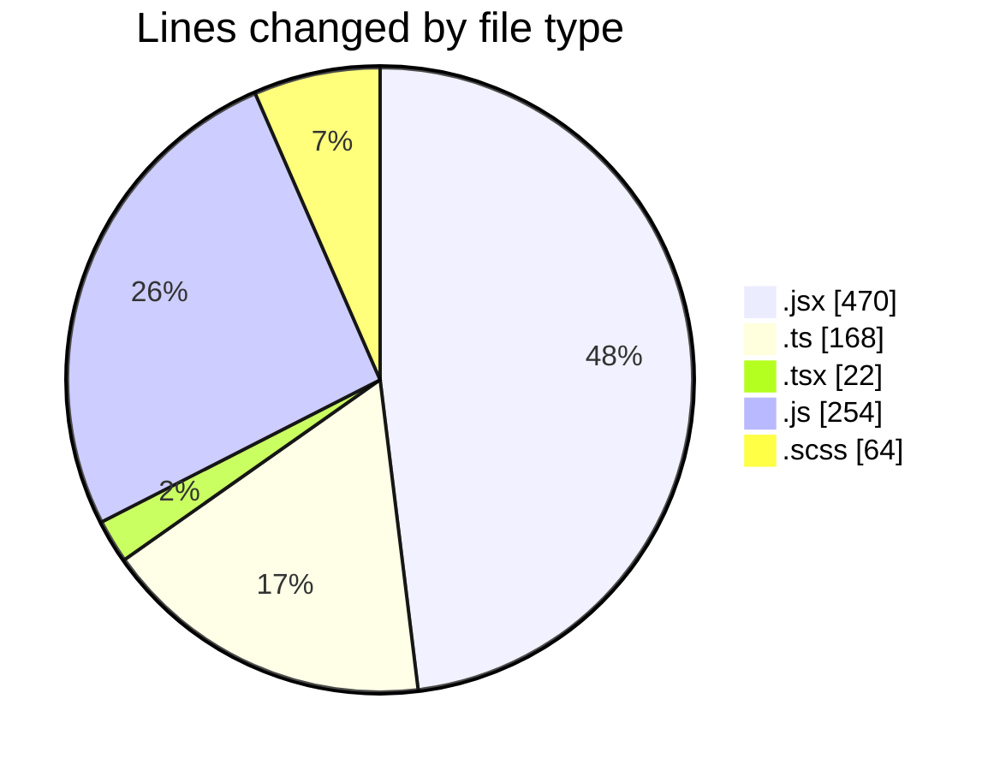
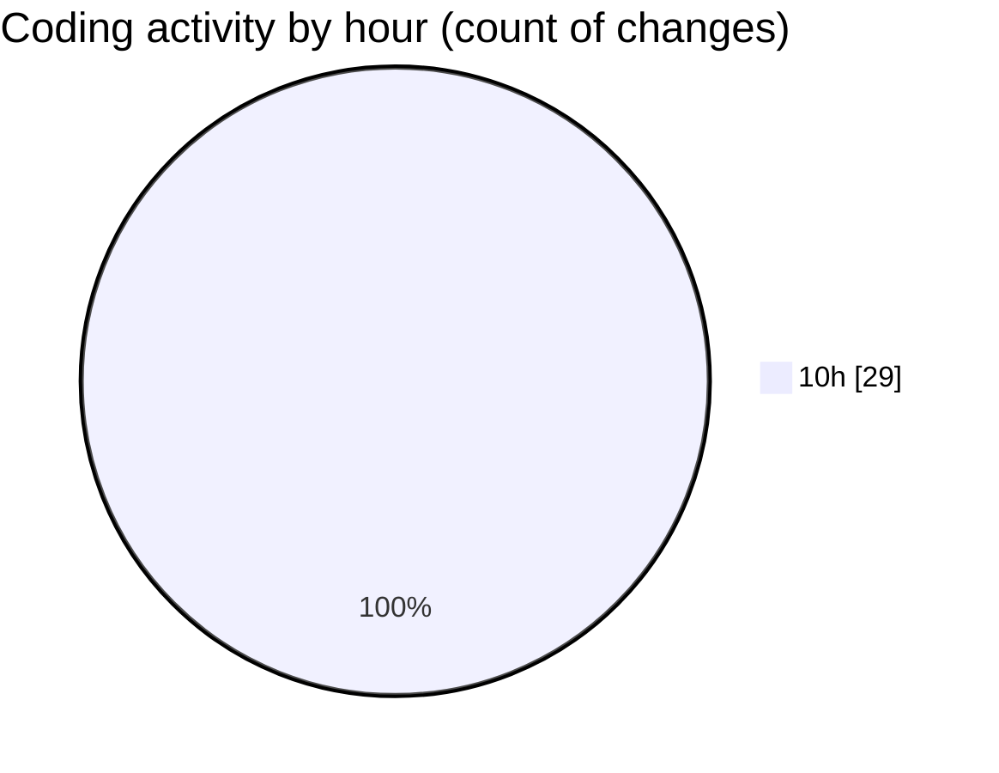

# cda - Activity Summary 

## Overall Statistics

| Stat                   | Value                                                             |
| ---------------------- | ----------------------------------------------------------------- |
| **Lines Added** (➕)   | 444                                          |
| **Lines Removed** (➖) | 534                                        |
| **Net Change** (↕)    | -90                |
| **Active Time** (⌚)   | 52 minutes |

## Modified Files
- **SkillTagModal.jsx** (+173, -198)
- **SubSkillOverview.jsx** (+0, -5)
- **profile-hub.ts** (+65, -103)
- **PreferenceSkillTags.tsx** (+0, -22)
- **mutations.js** (+80, -80)
- **SkillTagModal.scss** (+32, -32)
- **SkillTopic.jsx** (+47, -47)
- **App.js** (+10, -10)
- **queries.js** (+37, -37)

## Visualizations

### By File Type (Lines Changed)

### By Hour (Estimated Activity Count)

> **Last Updated:** 05/06/2025, 10:59:29