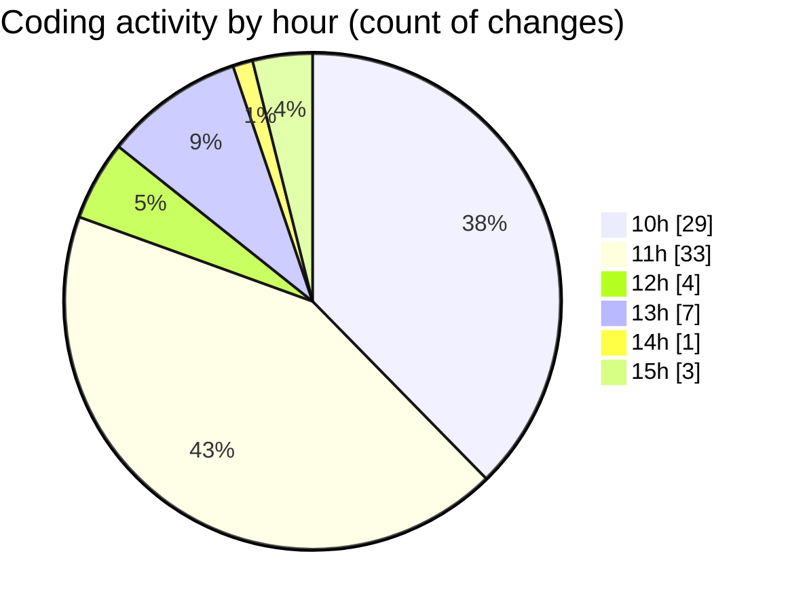

# cda - Activity Summary 

## Overall Statistics

| Stat                   | Value                                                             |
| ---------------------- | ----------------------------------------------------------------- |
| **Lines Added** (➕)   | 16051                                          |
| **Lines Removed** (➖) | 729                                        |
| **Net Change** (↕)    | 15322                |
| **Active Time** (⌚)   | 82 minutes |

## Modified Files
- **SkillTagModal.jsx** (+641, -242)
- **SubSkillOverview.jsx** (+60, -10)
- **profile-hub.ts** (+1158, -206)
- **PreferenceSkillTags.tsx** (+212, -64)
- **mutations.js** (+674, -80)
- **SkillTagModal.scss** (+57, -32)
- **SkillTopic.jsx** (+316, -47)
- **App.js** (+190, -10)
- **queries.js** (+550, -37)
- **MarkdownEditor.scss** (+8, -0)
- **SkillTopic.test.js** (+158, -0)
- **SkillTag.test.tsx** (+45, -0)
- **PreferenceSkillTags.test.tsx** (+281, -0)
- **SkillTopic.scss** (+132, -0)
- **gql.ts** (+73, -0)
- **graphql.ts** (+5683, -0)
- **package.json** (+74, -0)
- **graphql.ts** (+4802, -0)
- **gql.ts** (+278, -0)
- **subSkillTag-mutations.js** (+283, -0)
- **.env** (+39, -0)
- **SubSkillTopic.jsx** (+235, -1)
- **SkillUsersList.tsx** (+102, -0)

## Visualizations

### By File Type (Lines Changed)

### By Hour (Estimated Activity Count)

> **Last Updated:** 05/06/2025, 15:11:17