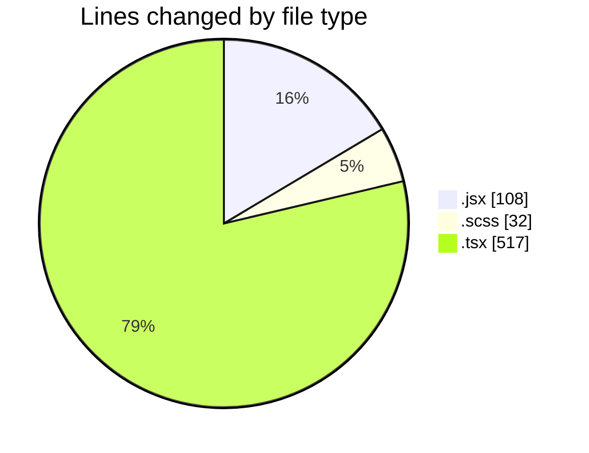
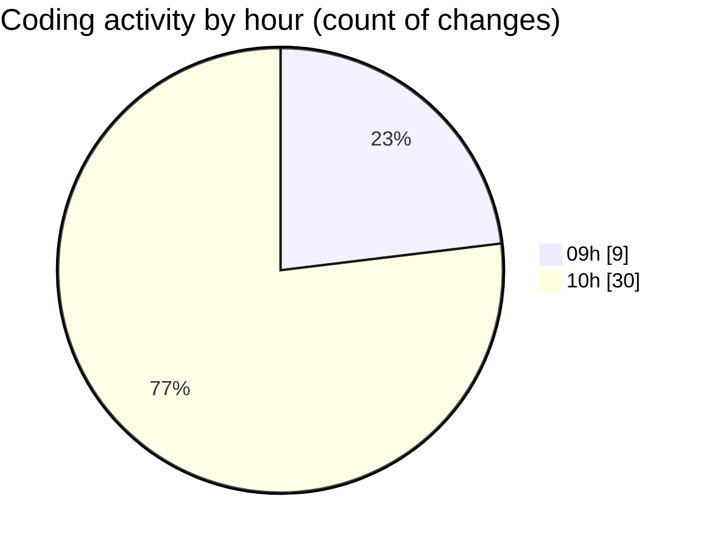

# cda - Activity Summary 

## Overall Statistics

| Stat                   | Value                                                             |
| ---------------------- | ----------------------------------------------------------------- |
| **Lines Added** (➕)   | 402                                          |
| **Lines Removed** (➖) | 255                                        |
| **Net Change** (↕)    | 147                |
| **Active Time** (⌚)   | 59 minutes |

## Modified Files
- **TagTopic.jsx** (+0, -2)
- **SkillTagModal.scss** (+32, -0)
- **PreferenceSkillTags.tsx** (+284, -233)
- **TagOverview.jsx** (+3, -0)
- **SkillTagsPanel.jsx** (+83, -20)

## Visualizations

### By File Type (Lines Changed)

### By Hour (Estimated Activity Count)

> **Last Updated:** 06/06/2025, 10:52:18