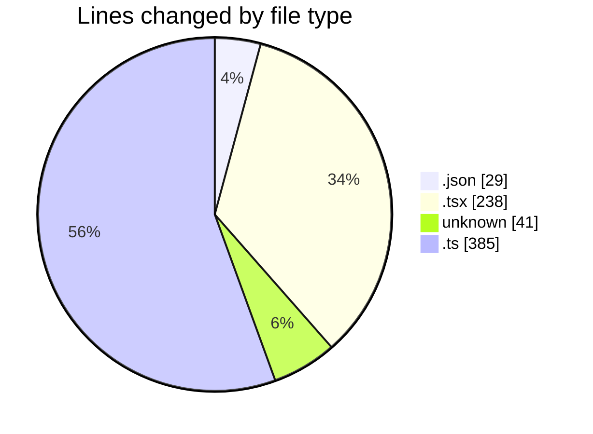
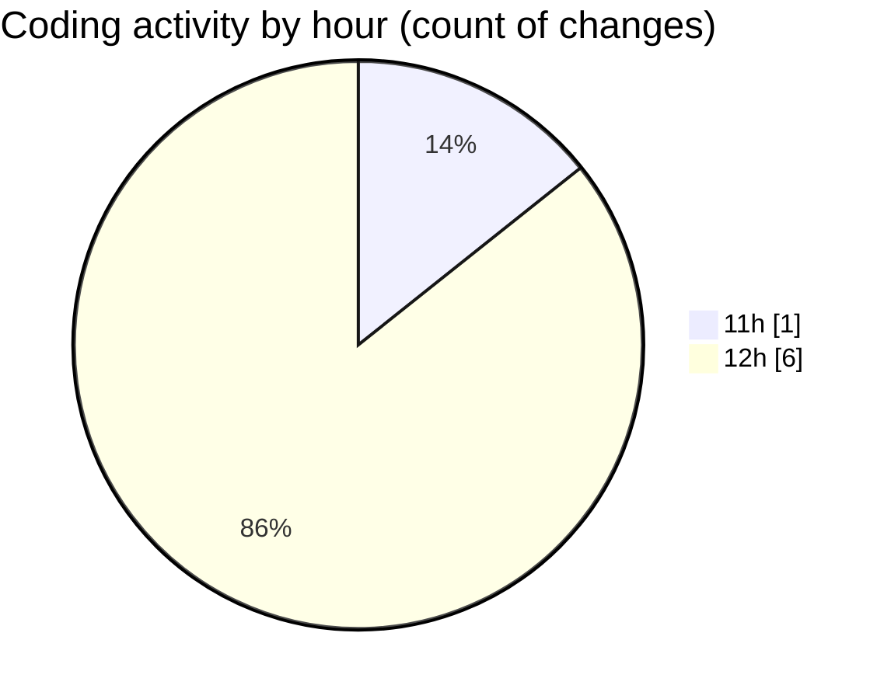

# cda - Activity Summary 

## Overall Statistics

| Stat                   | Value                                                             |
| ---------------------- | ----------------------------------------------------------------- |
| **Lines Added** (➕)   | 689                                          |
| **Lines Removed** (➖) | 4                                        |
| **Net Change** (↕)    | 685                |
| **Active Time** (⌚)   | 4 minutes |

## Modified Files
- **package.json** (+29, -0)
- **App.tsx** (+234, -4)
- **.env** (+41, -0)
- **getAllocateDuties.ts** (+385, -0)

## Visualizations

### By File Type (Lines Changed)

### By Hour (Estimated Activity Count)

> **Last Updated:** 09/06/2025, 12:38:50