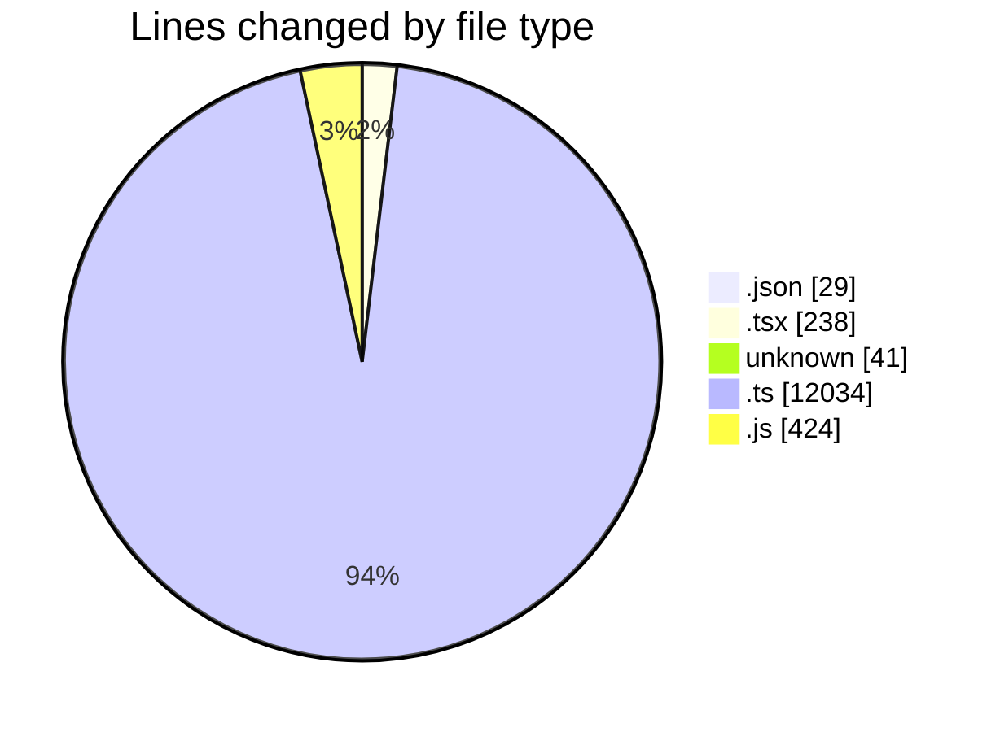
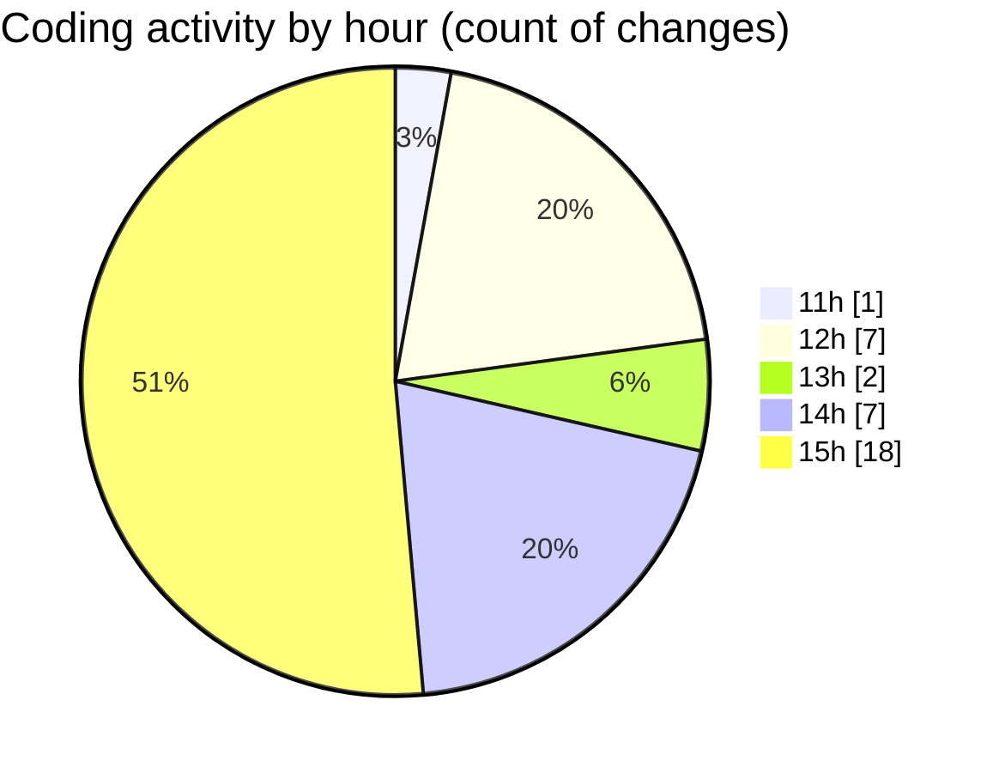

# cda - Activity Summary 

## Overall Statistics

| Stat                   | Value                                                             |
| ---------------------- | ----------------------------------------------------------------- |
| **Lines Added** (➕)   | 12111                                          |
| **Lines Removed** (➖) | 655                                        |
| **Net Change** (↕)    | 11456                |
| **Active Time** (⌚)   | 44 minutes |

## Modified Files
- **package.json** (+29, -0)
- **App.tsx** (+234, -4)
- **.env** (+41, -0)
- **getAllocateDuties.ts** (+385, -62)
- **skill-tags.ts** (+129, -0)
- **profile-hub.ts** (+1025, -12)
- **profile-hub.js** (+424, -0)
- **resolvers-types.ts** (+8945, -0)
- **skillTag-admin-mutations.ts** (+899, -577)

## Visualizations

### By File Type (Lines Changed)

### By Hour (Estimated Activity Count)

> **Last Updated:** 09/06/2025, 15:58:50