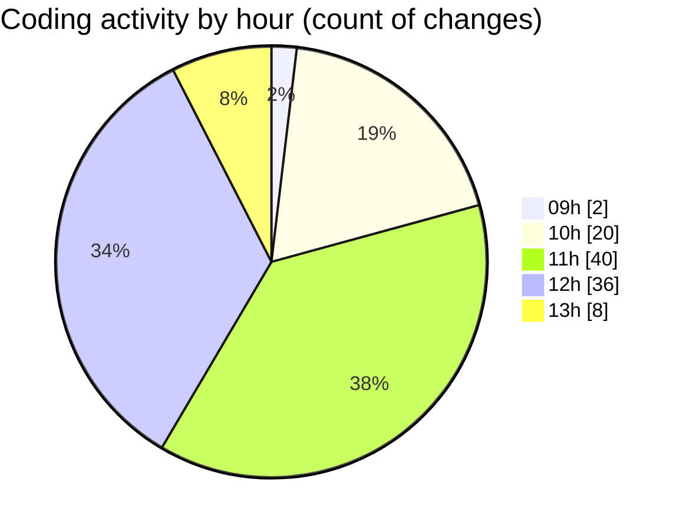

# cda - Activity Summary 

## Overall Statistics

| Stat                   | Value                                                             |
| ---------------------- | ----------------------------------------------------------------- |
| **Lines Added** (➕)   | 2139                                          |
| **Lines Removed** (➖) | 502                                        |
| **Net Change** (↕)    | 1637                |
| **Active Time** (⌚)   | 156 minutes |

## Modified Files
- **PoolPosition.tsx** (+584, -0)
- **HelperGlossary.tsx** (+547, -303)
- **Permissions.tsx** (+403, -0)
- **InitiativeForecasts.tsx** (+150, -0)
- **index.tsx** (+4, -1)
- **EditableTextInput.tsx** (+261, -143)
- **EditableTextInput.test.tsx** (+190, -55)

## Visualizations

### By File Type (Lines Changed)

### By Hour (Estimated Activity Count)

> **Last Updated:** 13/06/2025, 13:42:43