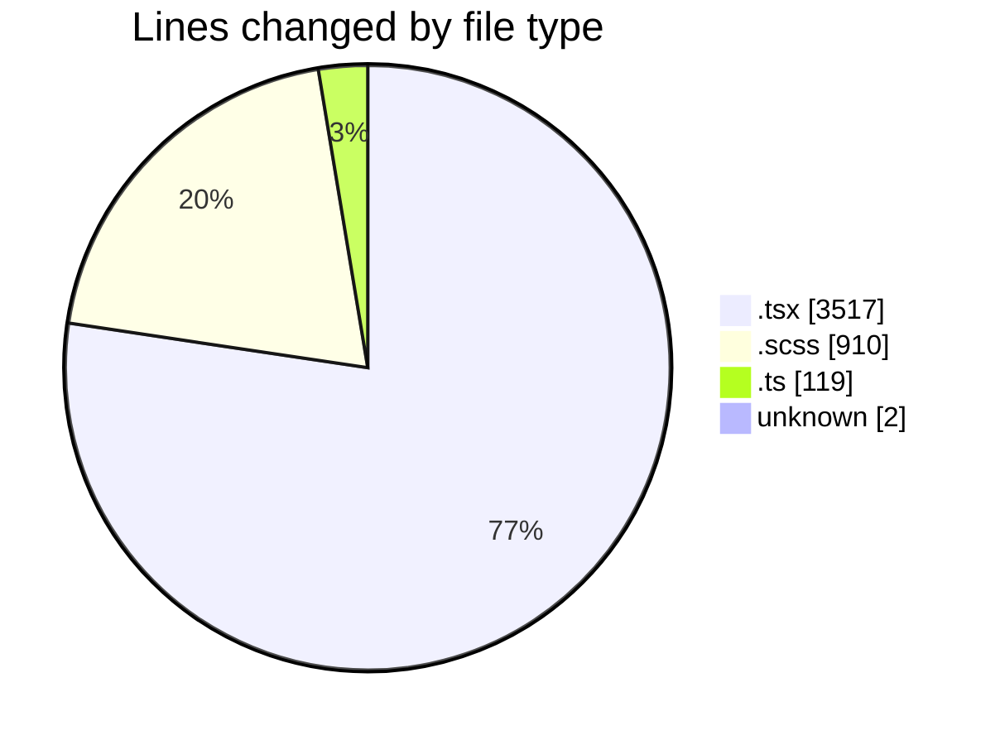
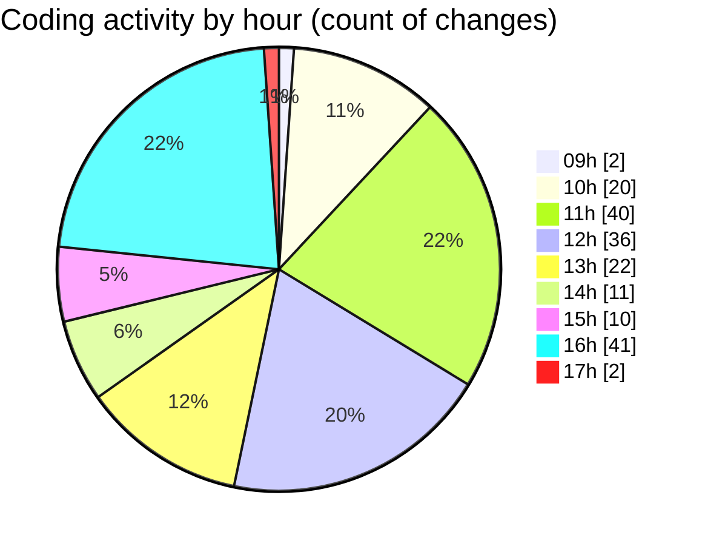

# cda - Activity Summary 

## Overall Statistics

| Stat                   | Value                                                             |
| ---------------------- | ----------------------------------------------------------------- |
| **Lines Added** (➕)   | 3765                                          |
| **Lines Removed** (➖) | 783                                        |
| **Net Change** (↕)    | 2982                |
| **Active Time** (⌚)   | 263 minutes |

## Modified Files
- **PoolPosition.tsx** (+584, -0)
- **HelperGlossary.tsx** (+557, -323)
- **Permissions.tsx** (+403, -0)
- **InitiativeForecasts.tsx** (+150, -0)
- **index.tsx** (+4, -1)
- **EditableTextInput.tsx** (+278, -160)
- **EditableTextInput.test.tsx** (+190, -55)
- **EditableTextInput.scss** (+54, -19)
- **config.ts** (+118, -1)
- **Panel.tsx** (+32, -0)
- **App.scss** (+395, -196)
- **HelperModal,scss** (+2, -0)
- **DetailsField.scss** (+39, -1)
- **PoolPosition.scss** (+80, -6)
- **App.tsx** (+546, -0)
- **HelperGlossary.tsx** (+234, -0)
- **DetailsToolTip.scss** (+72, -0)
- **HelperModal.scss** (+27, -21)

## Visualizations

### By File Type (Lines Changed)

### By Hour (Estimated Activity Count)

> **Last Updated:** 13/06/2025, 17:02:43