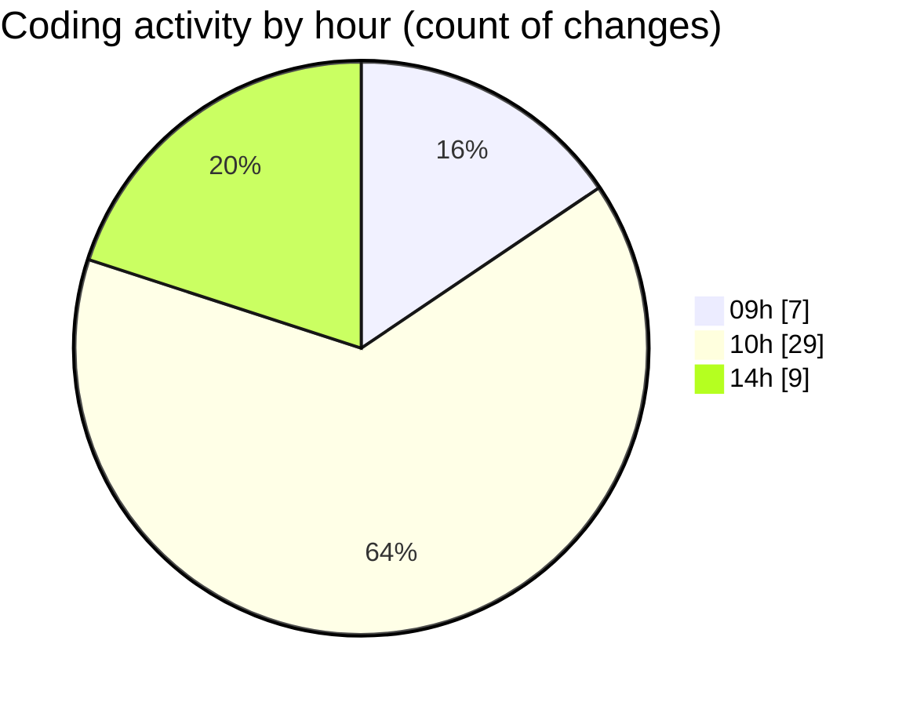

# cda - Activity Summary 

## Overall Statistics

| Stat                   | Value                                                             |
| ---------------------- | ----------------------------------------------------------------- |
| **Lines Added** (➕)   | 2608                                          |
| **Lines Removed** (➖) | 36                                        |
| **Net Change** (↕)    | 2572                |
| **Active Time** (⌚)   | 61 minutes |

## Modified Files
- **InitiativeDetails.tsx** (+1530, -0)
- **InitiativeDetails.scss** (+27, -11)
- **Panel.scss** (+18, -8)
- **Panel.tsx** (+33, -0)
- **20240430205550-insert-initiative-class.js** (+15, -0)
- **HelperGlossary.tsx** (+244, -9)
- **EditableTextInput.tsx** (+120, -0)
- **20250616130140-update-initiative-class.js** (+29, -8)
- **App.tsx** (+546, -0)
- **20250616132159-update-initiative-status-data.js** (+25, -0)
- **20250616130140-update-initiative-class-data.js** (+21, -0)

## Visualizations

### By File Type (Lines Changed)

### By Hour (Estimated Activity Count)

> **Last Updated:** 16/06/2025, 14:40:08