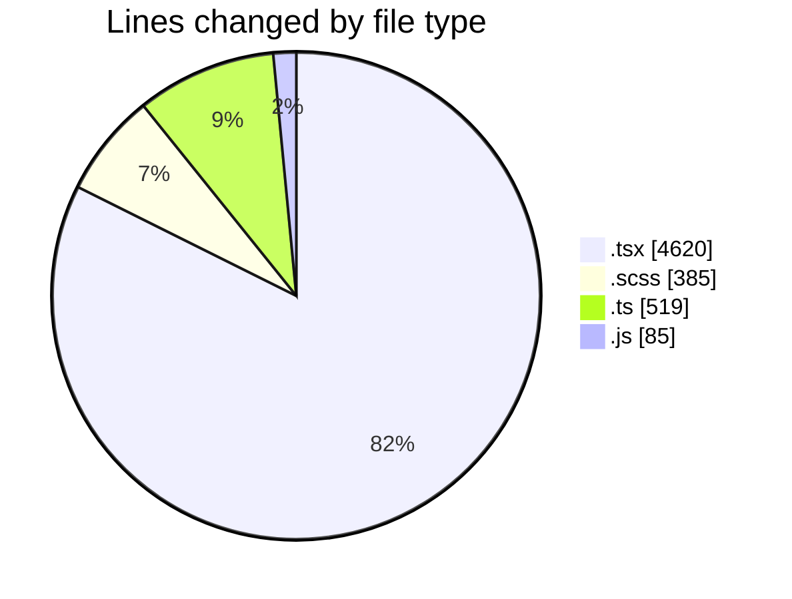
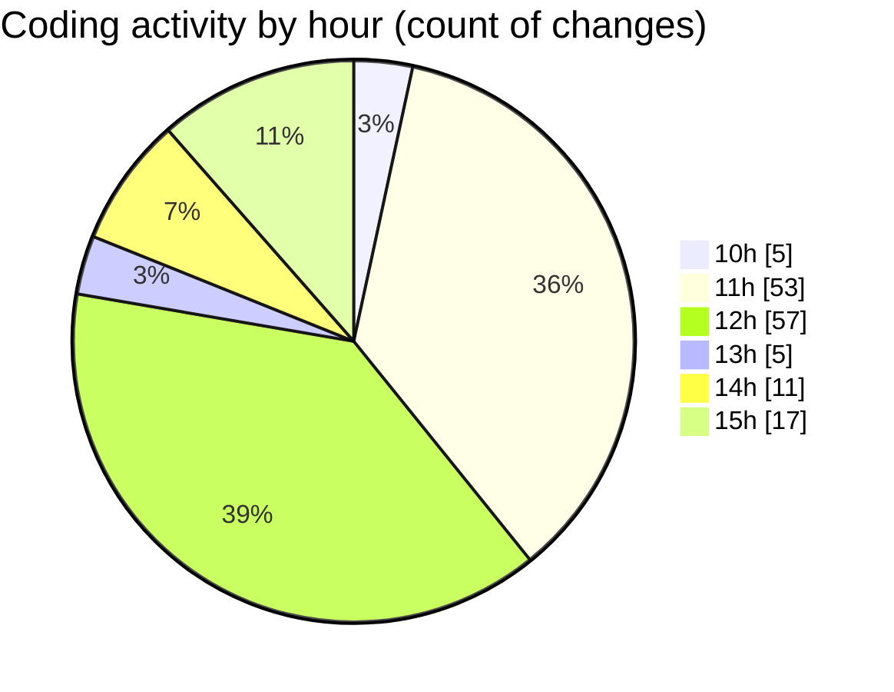

# cda - Activity Summary 

## Overall Statistics

| Stat                   | Value                                                             |
| ---------------------- | ----------------------------------------------------------------- |
| **Lines Added** (➕)   | 4886                                          |
| **Lines Removed** (➖) | 723                                        |
| **Net Change** (↕)    | 4163                |
| **Active Time** (⌚)   | 213 minutes |

## Modified Files
- **HelperGlossary.tsx** (+841, -555)
- **InitiativeHeadcountForecasts.tsx** (+250, -0)
- **PositionDetails.tsx** (+166, -0)
- **PoolEvent.scss** (+149, -2)
- **stringConfig.ts** (+385, -134)
- **App.tsx** (+546, -11)
- **20250617122856-create-helper-tool-tip-table.js** (+65, -20)
- **CostActuals.tsx** (+130, -0)
- **InitiativeDetails.tsx** (+765, -0)
- **PoolDetails.tsx** (+502, -0)
- **RouteWrapper.tsx** (+213, -1)
- **EditableTextInput.test.tsx** (+135, -0)
- **Panel.tsx** (+32, -0)
- **App.scss** (+220, -0)
- **PoolPositionAmountsPanel.scss** (+14, -0)
- **InitiativesFiltersAndTable.tsx** (+248, -0)
- **DetailsField.tsx** (+225, -0)

## Visualizations

### By File Type (Lines Changed)

### By Hour (Estimated Activity Count)

> **Last Updated:** 17/06/2025, 15:17:54