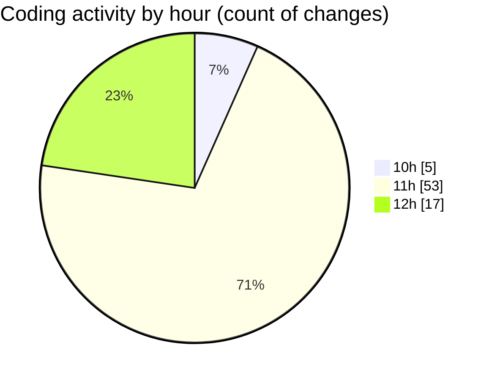

# cda - Activity Summary 

## Overall Statistics

| Stat                   | Value                                                             |
| ---------------------- | ----------------------------------------------------------------- |
| **Lines Added** (➕)   | 810                                          |
| **Lines Removed** (➖) | 411                                        |
| **Net Change** (↕)    | 399                |
| **Active Time** (⌚)   | 114 minutes |

## Modified Files
- **HelperGlossary.tsx** (+515, -409)
- **InitiativeHeadcountForecasts.tsx** (+125, -0)
- **PositionDetails.tsx** (+83, -0)
- **PoolEvent.scss** (+87, -2)

## Visualizations

### By File Type (Lines Changed)

### By Hour (Estimated Activity Count)

> **Last Updated:** 17/06/2025, 12:20:09