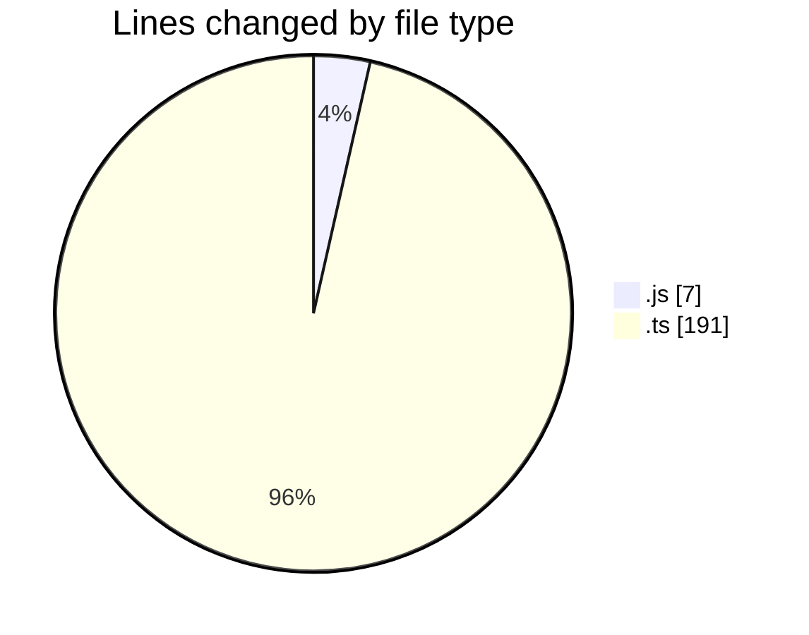
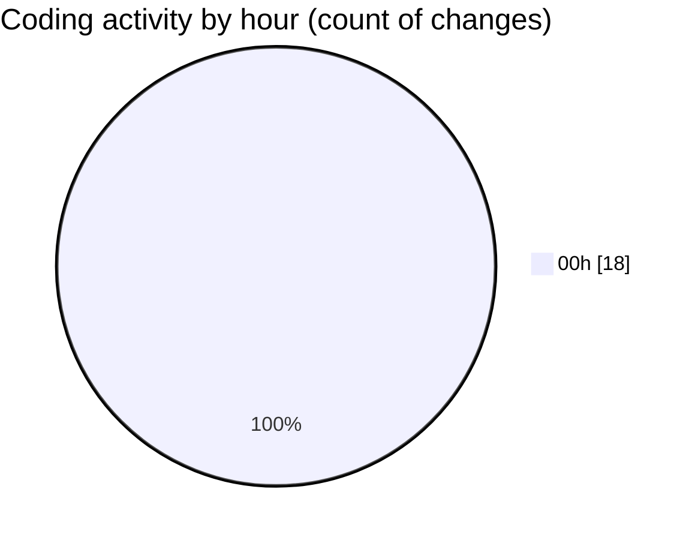

# cda - Activity Summary 

## Overall Statistics

| Stat                   | Value                                                             |
| ---------------------- | ----------------------------------------------------------------- |
| **Lines Added** (➕)   | 187                                          |
| **Lines Removed** (➖) | 11                                        |
| **Net Change** (↕)    | 176                |
| **Active Time** (⌚)   | 29 minutes |

## Modified Files
- **clear-view-mutations.js** (+7, -0)
- **clear-view-queries.ts** (+18, -6)
- **clear-view-mutations.ts** (+20, -1)
- **resolvers-types.ts** (+33, -0)
- **ClearView.ts** (+9, -4)
- **HelperTextService.ts** (+100, -0)

## Visualizations

### By File Type (Lines Changed)

### By Hour (Estimated Activity Count)

> **Last Updated:** 18/06/2025, 00:36:49