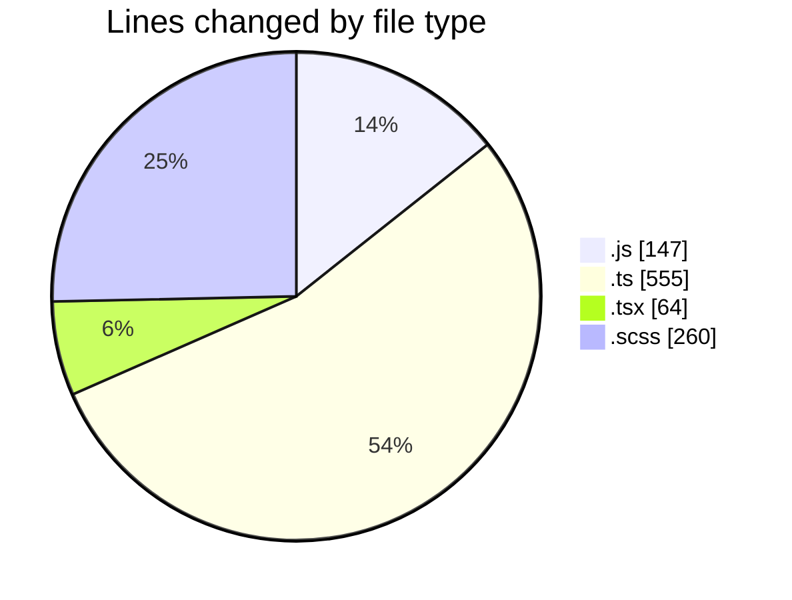
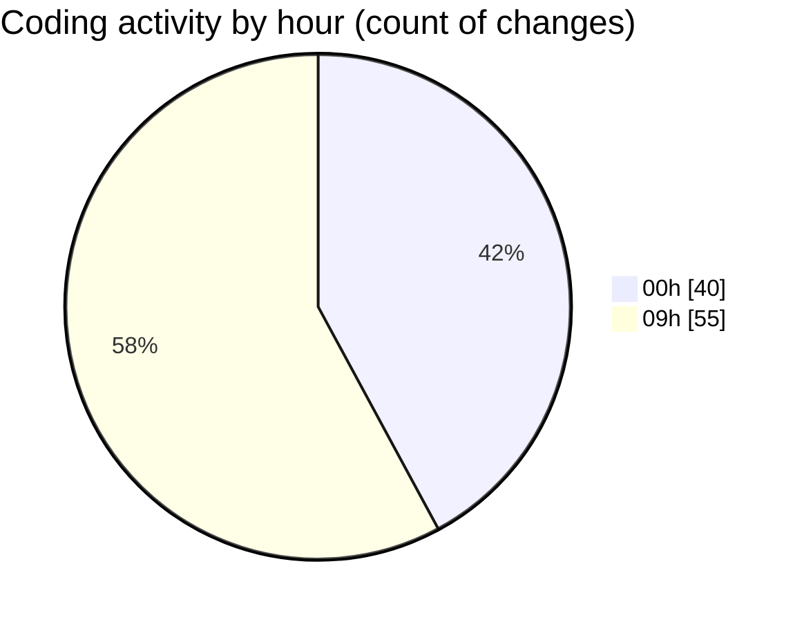

# cda - Activity Summary 

## Overall Statistics

| Stat                   | Value                                                             |
| ---------------------- | ----------------------------------------------------------------- |
| **Lines Added** (➕)   | 604                                          |
| **Lines Removed** (➖) | 422                                        |
| **Net Change** (↕)    | 182                |
| **Active Time** (⌚)   | 140 minutes |

## Modified Files
- **clear-view-mutations.js** (+23, -16)
- **clear-view-queries.ts** (+50, -38)
- **clear-view-mutations.ts** (+58, -39)
- **resolvers-types.ts** (+33, -0)
- **ClearView.ts** (+19, -14)
- **HelperTextService.ts** (+137, -31)
- **clear-view-types.js** (+30, -30)
- **clear-view-queries.js** (+24, -24)
- **SystemService.ts** (+28, -28)
- **clear_view_views.ts** (+40, -40)
- **App.tsx** (+18, -18)
- **Panel.tsx** (+2, -2)
- **DetailsField.tsx** (+8, -8)
- **PoolEvent.scss** (+23, -23)
- **InitiativesFiltersAndTable.tsx** (+3, -3)
- **App.scss** (+77, -77)
- **PoolPositionAmountsPanel.scss** (+30, -30)
- **RouteWrapper.tsx** (+1, -1)

## Visualizations

### By File Type (Lines Changed)

### By Hour (Estimated Activity Count)

> **Last Updated:** 18/06/2025, 09:41:07