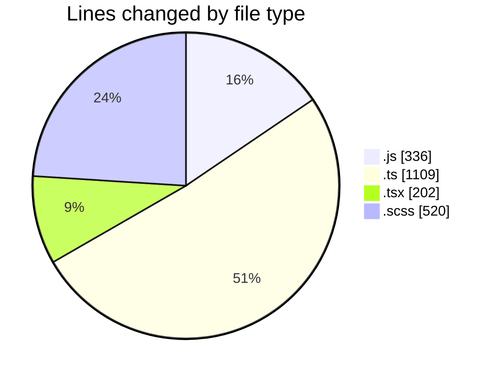
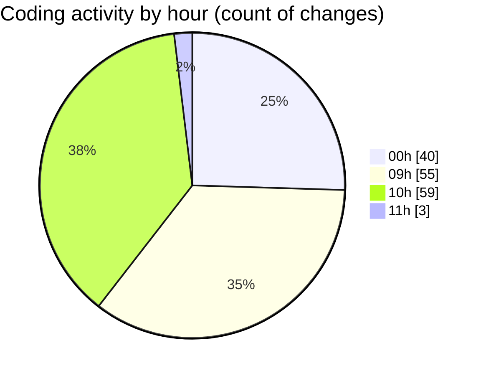

# cda - Activity Summary 

## Overall Statistics

| Stat                   | Value                                                             |
| ---------------------- | ----------------------------------------------------------------- |
| **Lines Added** (➕)   | 1232                                          |
| **Lines Removed** (➖) | 935                                        |
| **Net Change** (↕)    | 297                |
| **Active Time** (⌚)   | 206 minutes |

## Modified Files
- **clear-view-mutations.js** (+39, -32)
- **clear-view-queries.ts** (+82, -70)
- **clear-view-mutations.ts** (+96, -77)
- **resolvers-types.ts** (+142, -109)
- **ClearView.ts** (+29, -24)
- **HelperTextService.ts** (+137, -31)
- **clear-view-types.js** (+60, -60)
- **clear-view-queries.js** (+48, -48)
- **SystemService.ts** (+56, -56)
- **clear_view_views.ts** (+80, -80)
- **App.tsx** (+36, -36)
- **Panel.tsx** (+4, -4)
- **DetailsField.tsx** (+16, -16)
- **PoolEvent.scss** (+46, -46)
- **InitiativesFiltersAndTable.tsx** (+6, -6)
- **App.scss** (+154, -154)
- **PoolPositionAmountsPanel.scss** (+60, -60)
- **RouteWrapper.tsx** (+2, -2)
- **DetailsToolTip.tsx** (+74, -0)
- **clear_view_tables.ts** (+20, -20)
- **20250617122856-create-helper-text-table.js** (+45, -4)

## Visualizations

### By File Type (Lines Changed)

### By Hour (Estimated Activity Count)

> **Last Updated:** 18/06/2025, 11:36:07