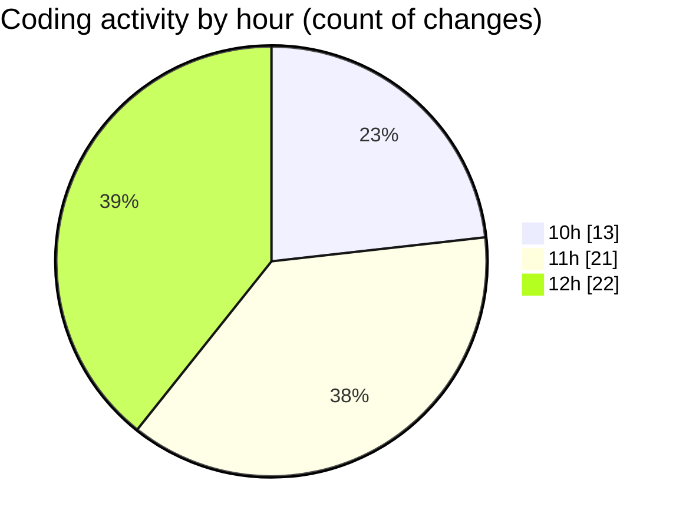

# cda - Activity Summary 

## Overall Statistics

| Stat                   | Value                                                             |
| ---------------------- | ----------------------------------------------------------------- |
| **Lines Added** (➕)   | 25621                                          |
| **Lines Removed** (➖) | 5699                                        |
| **Net Change** (↕)    | 19922                |
| **Active Time** (⌚)   | 83 minutes |

## Modified Files
- **clear-view-types.js** (+3, -36)
- **HelperTextService.ts** (+180, -72)
- **clear-view-queries.ts** (+1, -1)
- **clear-view-mutations.ts** (+452, -448)
- **resolvers-types.ts** (+19007, -5140)
- **InitiativeService.ts** (+561, -0)
- **errors.ts** (+15, -0)
- **tables.ts** (+5402, -0)
- **clear-view-queries.js** (+0, -2)

## Visualizations

### By File Type (Lines Changed)

### By Hour (Estimated Activity Count)

> **Last Updated:** 19/06/2025, 12:53:21