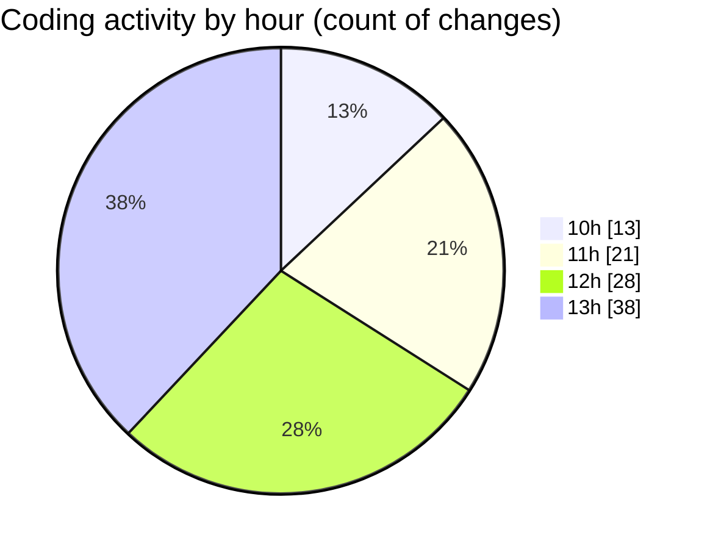

# cda - Activity Summary 

## Overall Statistics

| Stat                   | Value                                                             |
| ---------------------- | ----------------------------------------------------------------- |
| **Lines Added** (➕)   | 44907                                          |
| **Lines Removed** (➖) | 11600                                        |
| **Net Change** (↕)    | 33307                |
| **Active Time** (⌚)   | 151 minutes |

## Modified Files
- **clear-view-types.js** (+3, -36)
- **HelperTextService.ts** (+186, -83)
- **clear-view-queries.ts** (+1, -1)
- **clear-view-mutations.ts** (+452, -450)
- **resolvers-types.ts** (+21573, -10274)
- **InitiativeService.ts** (+561, -0)
- **errors.ts** (+15, -0)
- **tables.ts** (+5422, -0)
- **clear-view-queries.js** (+1, -2)
- **clear-view-queries.js** (+488, -2)
- **views.ts** (+8243, -0)
- **graphql.ts** (+7161, -0)
- **HelperTextService.test.ts** (+801, -752)

## Visualizations

### By File Type (Lines Changed)

### By Hour (Estimated Activity Count)

> **Last Updated:** 19/06/2025, 14:00:42