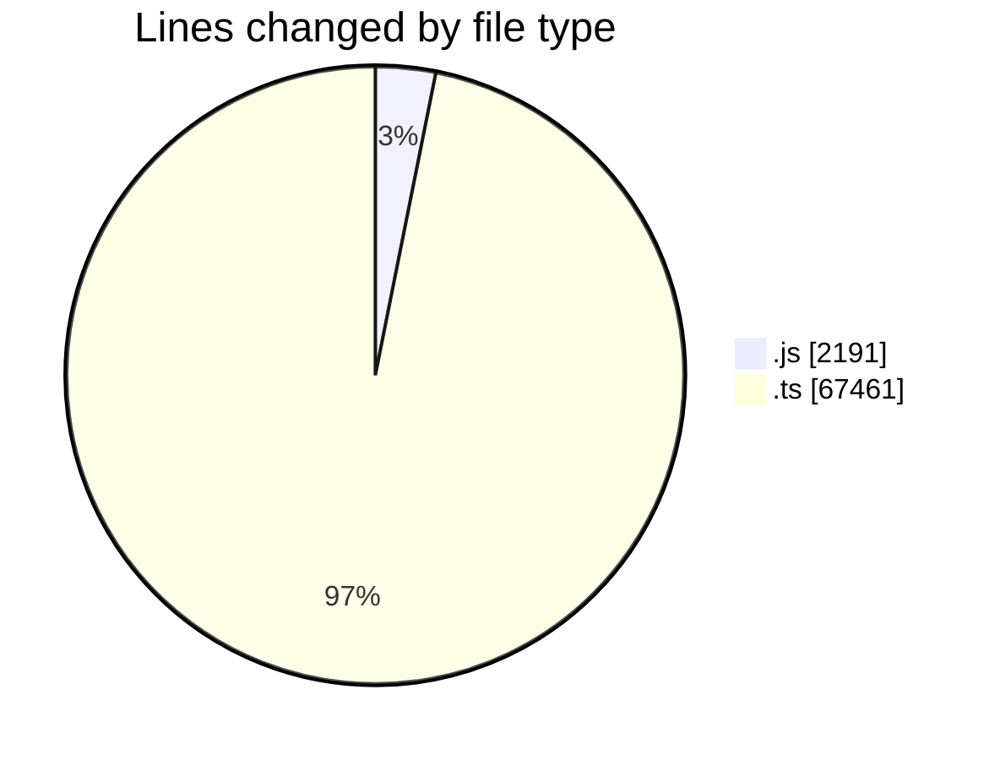
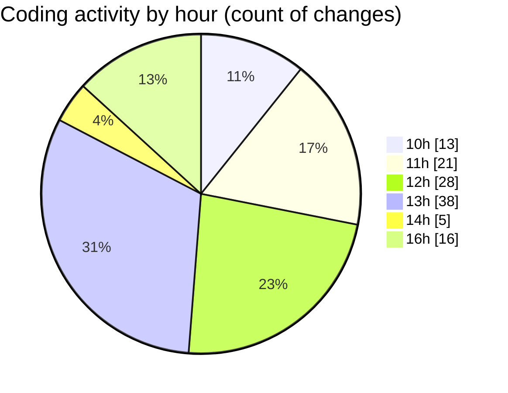

# cda - Activity Summary 

## Overall Statistics

| Stat                   | Value                                                             |
| ---------------------- | ----------------------------------------------------------------- |
| **Lines Added** (➕)   | 58016                                          |
| **Lines Removed** (➖) | 11636                                        |
| **Net Change** (↕)    | 46380                |
| **Active Time** (⌚)   | 184 minutes |

## Modified Files
- **clear-view-types.js** (+1005, -36)
- **HelperTextService.ts** (+292, -91)
- **clear-view-queries.ts** (+1, -1)
- **clear-view-mutations.ts** (+452, -450)
- **resolvers-types.ts** (+32872, -10274)
- **InitiativeService.ts** (+561, -0)
- **errors.ts** (+15, -0)
- **tables.ts** (+5422, -0)
- **clear-view-queries.js** (+1, -2)
- **clear-view-queries.js** (+488, -2)
- **views.ts** (+8243, -0)
- **graphql.ts** (+7161, -0)
- **HelperTextService.test.ts** (+802, -755)
- **20250617122856-create-helper-text-table.js** (+40, -25)
- **20250619151034-insert-data-to-helper-text-table.js** (+33, -0)
- **clear-view-mutations.js** (+559, -0)
- **index.ts** (+69, -0)

## Visualizations

### By File Type (Lines Changed)

### By Hour (Estimated Activity Count)

> **Last Updated:** 19/06/2025, 16:40:42