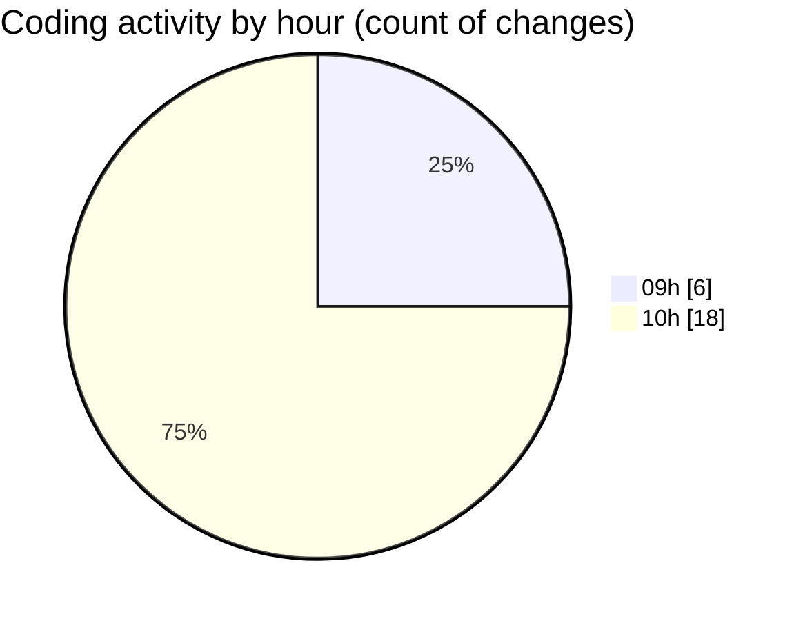

# cda - Activity Summary 

## Overall Statistics

| Stat                   | Value                                                             |
| ---------------------- | ----------------------------------------------------------------- |
| **Lines Added** (➕)   | 26721                                          |
| **Lines Removed** (➖) | 23                                        |
| **Net Change** (↕)    | 26698                |
| **Active Time** (⌚)   | 44 minutes |

## Modified Files
- **HelperTextService.ts** (+103, -4)
- **clear-view-mutations.ts** (+442, -19)
- **clear_view_tables.ts** (+909, -0)
- **clear-view-types.js** (+980, -0)
- **clear-view-mutations.js** (+551, -0)
- **clear-view-queries.js** (+470, -0)
- **clear-view-queries.ts** (+619, -0)
- **errors.ts** (+15, -0)
- **SystemService.ts** (+410, -0)
- **index.ts** (+68, -0)
- **ClearView.ts** (+338, -0)
- **clear_view_views.ts** (+3030, -0)
- **graphql.ts** (+7044, -0)
- **resolvers-types.ts** (+11182, -0)
- **App.tsx** (+545, -0)
- **helperText.ts** (+15, -0)

## Visualizations

### By File Type (Lines Changed)

### By Hour (Estimated Activity Count)

> **Last Updated:** 20/06/2025, 10:53:06