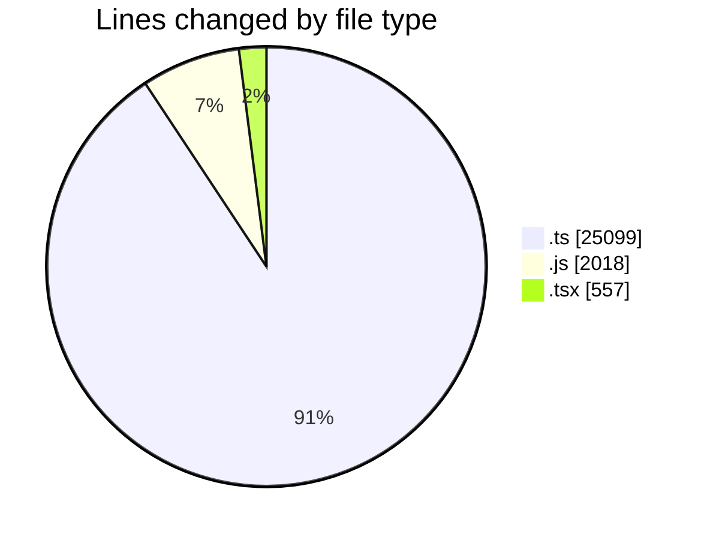
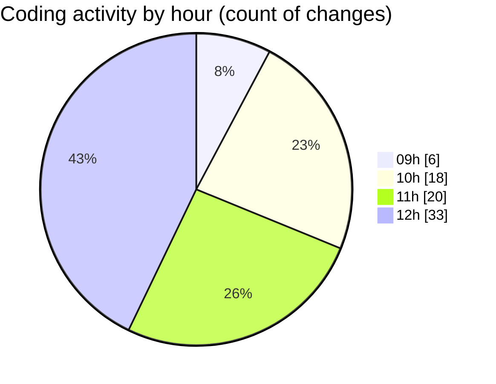

# cda - Activity Summary 

## Overall Statistics

| Stat                   | Value                                                             |
| ---------------------- | ----------------------------------------------------------------- |
| **Lines Added** (➕)   | 27533                                          |
| **Lines Removed** (➖) | 141                                        |
| **Net Change** (↕)    | 27392                |
| **Active Time** (⌚)   | 114 minutes |

## Modified Files
- **HelperTextService.ts** (+103, -10)
- **clear-view-mutations.ts** (+461, -19)
- **clear_view_tables.ts** (+909, -0)
- **clear-view-types.js** (+980, -0)
- **clear-view-mutations.js** (+551, -0)
- **clear-view-queries.js** (+470, -0)
- **clear-view-queries.ts** (+663, -0)
- **errors.ts** (+15, -0)
- **SystemService.ts** (+412, -2)
- **index.ts** (+68, -0)
- **ClearView.ts** (+345, -1)
- **clear_view_views.ts** (+3030, -0)
- **graphql.ts** (+7044, -0)
- **resolvers-types.ts** (+11435, -0)
- **App.tsx** (+556, -1)
- **helperText.ts** (+36, -0)
- **helperText.ts** (+69, -29)
- **HelperTextService.test.ts** (+194, -2)
- **errors.test.ts** (+29, -0)
- **20250617122856-create-helper-text-table.js** (+17, -0)
- **helperText.ts** (+146, -77)

## Visualizations

### By File Type (Lines Changed)

### By Hour (Estimated Activity Count)

> **Last Updated:** 20/06/2025, 12:58:06