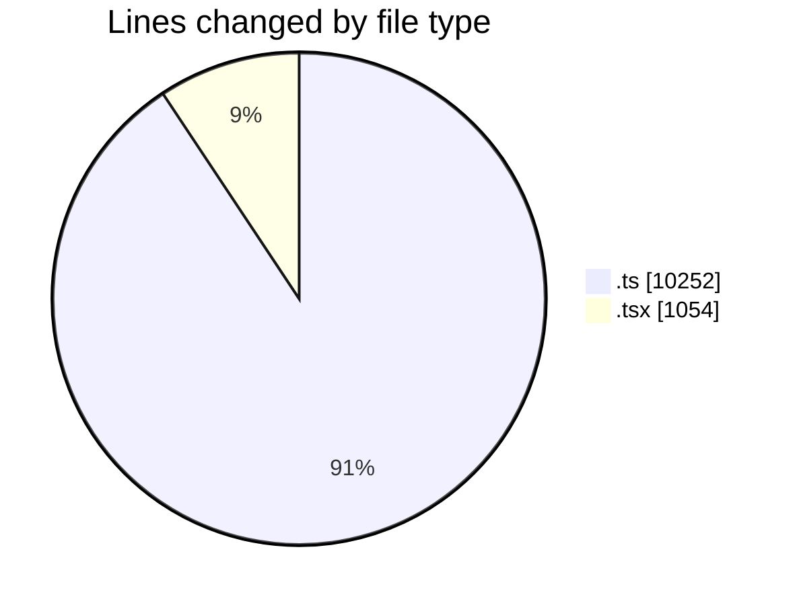
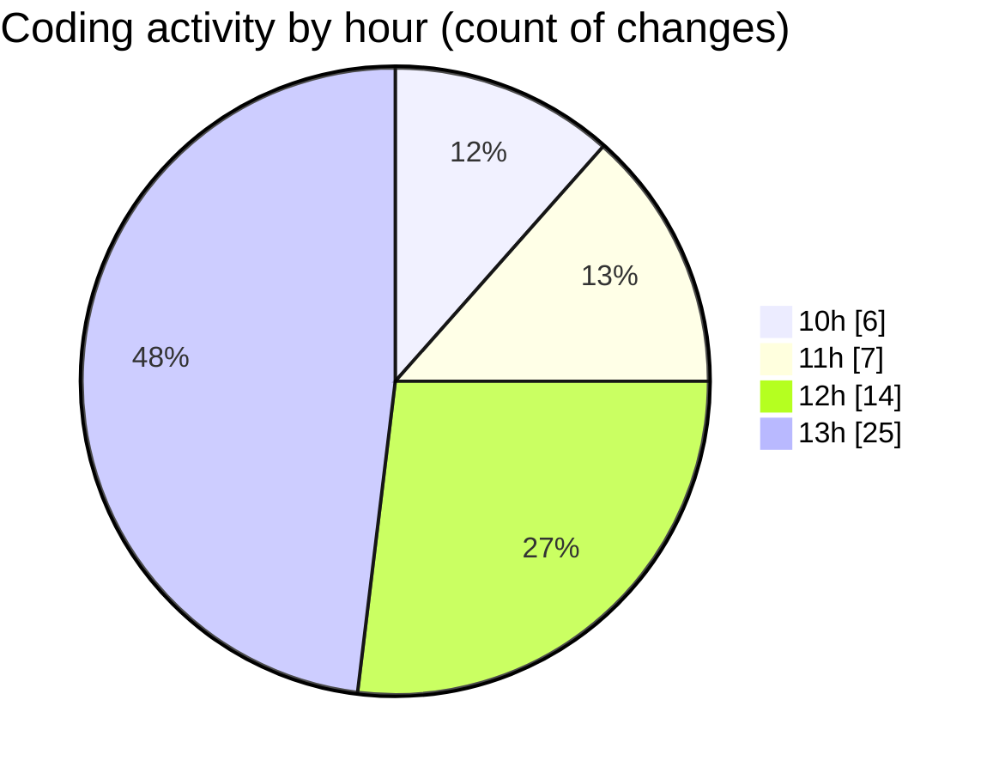

# cda - Activity Summary 

## Overall Statistics

| Stat                   | Value                                                             |
| ---------------------- | ----------------------------------------------------------------- |
| **Lines Added** (➕)   | 11253                                          |
| **Lines Removed** (➖) | 53                                        |
| **Net Change** (↕)    | 11200                |
| **Active Time** (⌚)   | 65 minutes |

## Modified Files
- **graphql.ts** (+7257, -0)
- **App.tsx** (+595, -30)
- **initiatives.ts** (+1888, -2)
- **clear-view-queries.ts** (+663, -0)
- **clear-view-mutations.ts** (+442, -0)
- **Panel.tsx** (+33, -0)
- **HelperGlossary.tsx** (+375, -21)

## Visualizations

### By File Type (Lines Changed)

### By Hour (Estimated Activity Count)

> **Last Updated:** 23/06/2025, 13:18:01