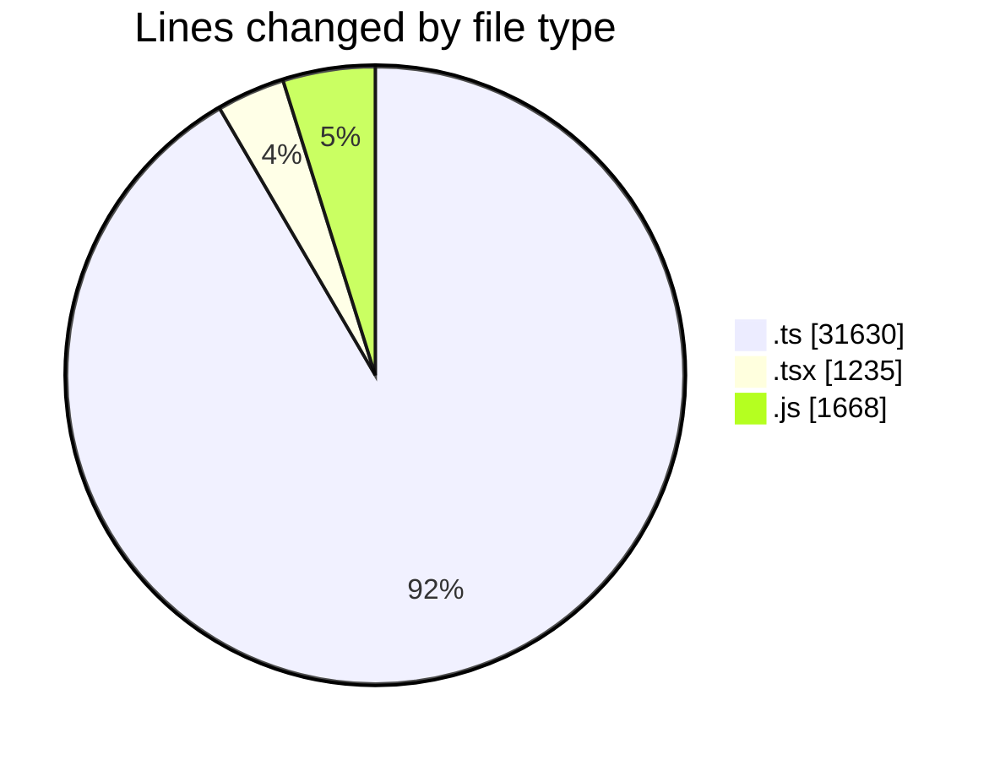
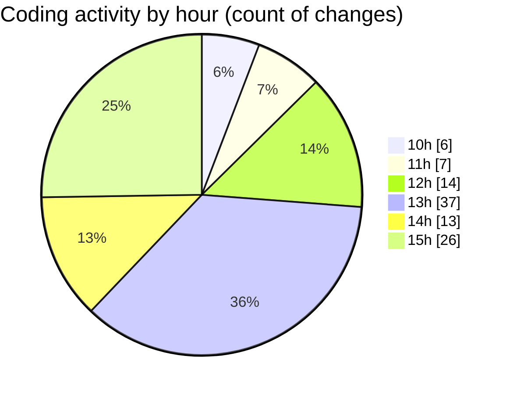

# cda - Activity Summary 

## Overall Statistics

| Stat                   | Value                                                             |
| ---------------------- | ----------------------------------------------------------------- |
| **Lines Added** (➕)   | 34447                                          |
| **Lines Removed** (➖) | 86                                        |
| **Net Change** (↕)    | 34361                |
| **Active Time** (⌚)   | 137 minutes |

## Modified Files
- **graphql.ts** (+7257, -0)
- **App.tsx** (+595, -40)
- **initiatives.ts** (+1889, -2)
- **clear-view-queries.ts** (+663, -0)
- **clear-view-mutations.ts** (+971, -13)
- **Panel.tsx** (+33, -1)
- **HelperGlossary.tsx** (+409, -27)
- **EditableTextInput.tsx** (+130, -0)
- **clear-view-mutations.js** (+1167, -1)
- **clear-view-queries.js** (+500, -0)
- **system.ts** (+264, -0)
- **resolvers-types.ts** (+9040, -2)
- **resolvers-types.ts** (+11529, -0)

## Visualizations

### By File Type (Lines Changed)

### By Hour (Estimated Activity Count)

> **Last Updated:** 23/06/2025, 15:57:34