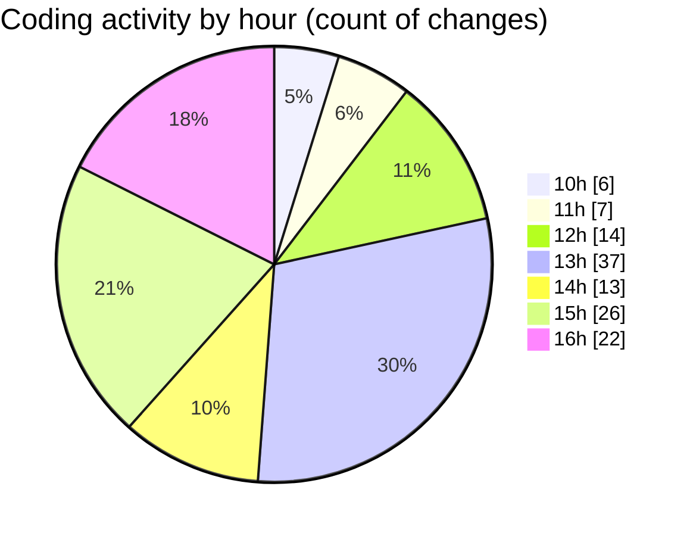

# cda - Activity Summary 

## Overall Statistics

| Stat                   | Value                                                             |
| ---------------------- | ----------------------------------------------------------------- |
| **Lines Added** (➕)   | 44038                                          |
| **Lines Removed** (➖) | 380                                        |
| **Net Change** (↕)    | 43658                |
| **Active Time** (⌚)   | 161 minutes |

## Modified Files
- **graphql.ts** (+14514, -0)
- **App.tsx** (+1150, -40)
- **initiatives.ts** (+1889, -2)
- **clear-view-queries.ts** (+663, -0)
- **clear-view-mutations.ts** (+1129, -161)
- **Panel.tsx** (+65, -1)
- **HelperGlossary.tsx** (+409, -27)
- **EditableTextInput.tsx** (+130, -0)
- **clear-view-mutations.js** (+1217, -51)
- **clear-view-queries.js** (+500, -0)
- **system.ts** (+264, -0)
- **resolvers-types.ts** (+9040, -4)
- **resolvers-types.ts** (+11623, -94)
- **InitiativesFiltersAndTable.tsx** (+248, -0)
- **App.scss** (+220, -0)
- **PoolPositionAmountsPanel.scss** (+14, -0)
- **gql.ts** (+688, -0)
- **PoolEvent.scss** (+62, -0)
- **RouteWrapper.tsx** (+213, -0)

## Visualizations

### By File Type (Lines Changed)

### By Hour (Estimated Activity Count)

> **Last Updated:** 23/06/2025, 16:27:34