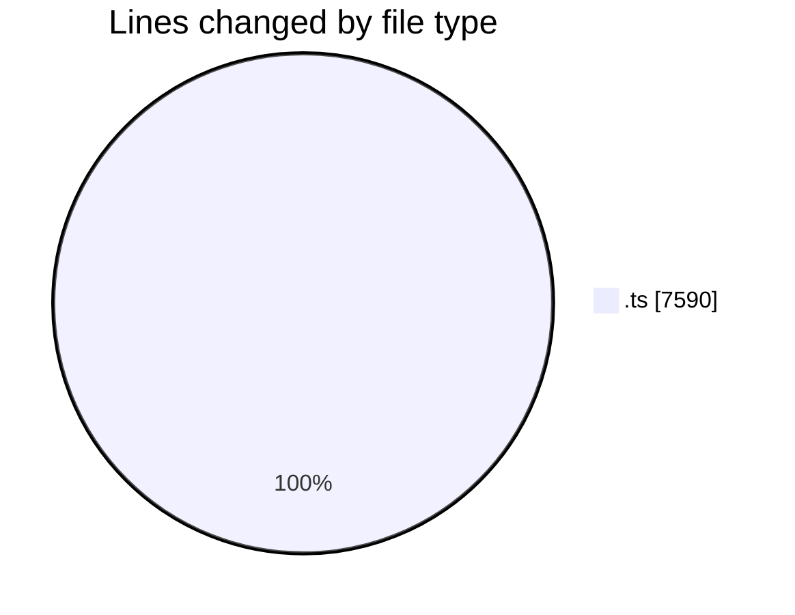
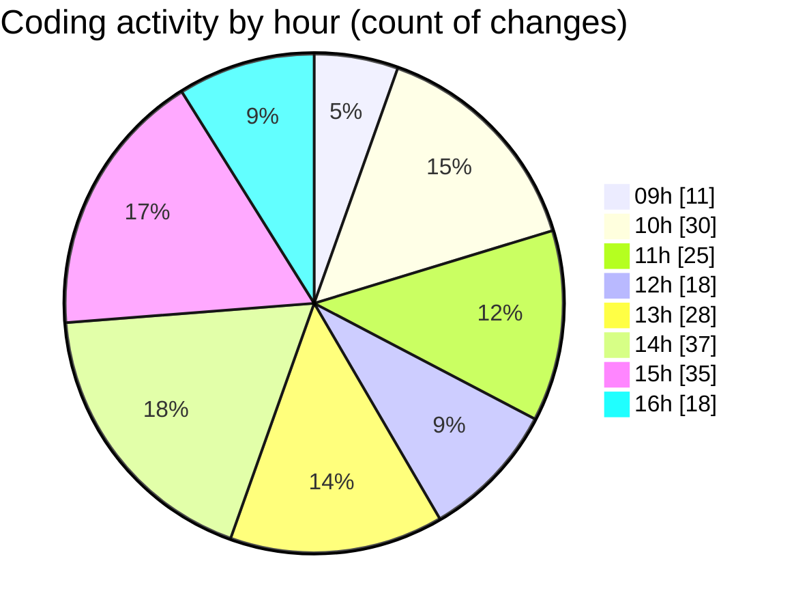

# cda - Activity Summary 

## Overall Statistics

| Stat                   | Value                                                             |
| ---------------------- | ----------------------------------------------------------------- |
| **Lines Added** (➕)   | 6200                                          |
| **Lines Removed** (➖) | 1390                                        |
| **Net Change** (↕)    | 4810                |
| **Active Time** (⌚)   | 327 minutes |

## Modified Files
- **SystemService.ts** (+1399, -425)
- **businesses.ts** (+54, -0)
- **MockSystemService.ts** (+390, -0)
- **ForecastReportingService.test.ts** (+456, -0)
- **SystemService.test.ts** (+2934, -965)
- **HelperTextService.test.ts** (+194, -0)
- **clear-view-mutations.ts** (+447, -0)
- **system.ts** (+326, -0)

## Visualizations

### By File Type (Lines Changed)

### By Hour (Estimated Activity Count)

> **Last Updated:** 24/06/2025, 16:26:16