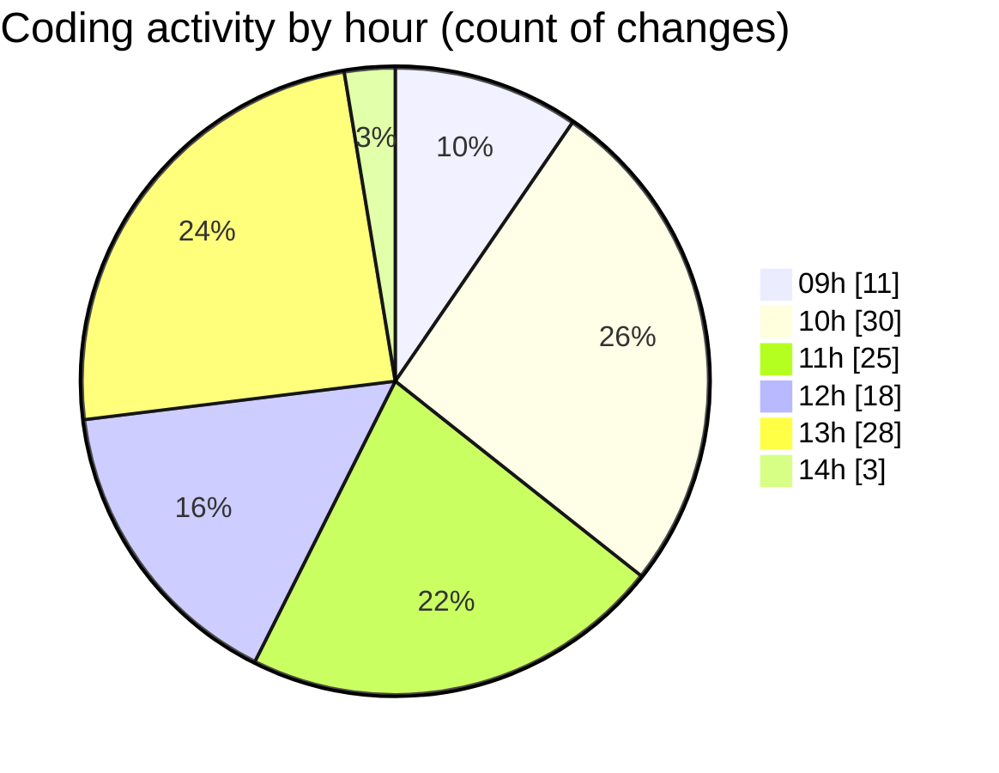

# cda - Activity Summary 

## Overall Statistics

| Stat                   | Value                                                             |
| ---------------------- | ----------------------------------------------------------------- |
| **Lines Added** (➕)   | 2588                                          |
| **Lines Removed** (➖) | 317                                        |
| **Net Change** (↕)    | 2271                |
| **Active Time** (⌚)   | 206 minutes |

## Modified Files
- **SystemService.ts** (+869, -315)
- **businesses.ts** (+54, -0)
- **MockSystemService.ts** (+215, -0)
- **ForecastReportingService.test.ts** (+456, -0)
- **SystemService.test.ts** (+994, -2)

## Visualizations

### By File Type (Lines Changed)

### By Hour (Estimated Activity Count)

> **Last Updated:** 24/06/2025, 14:05:47