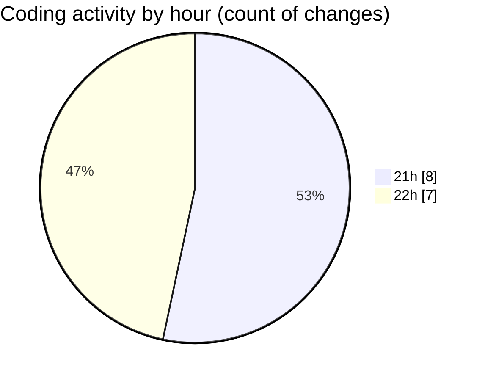

# samplePdf - Activity Summary 

## Overall Statistics

| Stat                   | Value                                                             |
| ---------------------- | ----------------------------------------------------------------- |
| **Lines Added** (➕)   | 622                                          |
| **Lines Removed** (➖) | 22                                        |
| **Net Change** (↕)    | 600                |
| **Active Time** (⌚)   | 33 minutes |

## Modified Files
- **app.py** (+90, -7)
- **processing_workflow.py** (+203, -1)
- **file_upload.py** (+87, -0)
- **schema.py** (+97, -14)
- **extract_site_totals.py** (+74, -0)
- **pdf_parsers.py** (+71, -0)

## Visualizations

### By File Type (Lines Changed)

### By Hour (Estimated Activity Count)

> **Last Updated:** 25/06/2025, 22:19:22