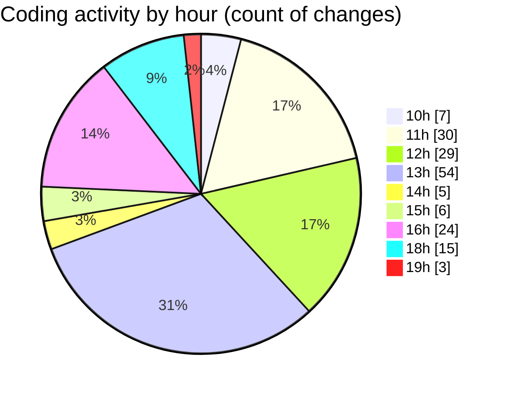

# cda - Activity Summary 

## Overall Statistics

| Stat                   | Value                                                             |
| ---------------------- | ----------------------------------------------------------------- |
| **Lines Added** (➕)   | 31476                                          |
| **Lines Removed** (➖) | 3847                                        |
| **Net Change** (↕)    | 27629                |
| **Active Time** (⌚)   | 248 minutes |

## Modified Files
- **system.ts** (+812, -85)
- **MockSystemService.ts** (+274, -2)
- **SystemService.ts** (+724, -302)
- **clear-view-mutations.ts** (+610, -16)
- **clear-view-queries.js** (+500, -0)
- **resolvers-types.ts** (+14506, -2677)
- **index.ts** (+79, -0)
- **resolvers-types.ts** (+9038, -0)
- **clear-view-types.js** (+1076, -0)
- **HelperTextService.test.ts** (+194, -0)
- **helperText.ts** (+199, -9)
- **clear-view-mutations.js** (+647, -2)
- **AdminService.ts** (+253, -10)
- **HelperTextService.ts** (+94, -1)
- **SystemService.test.ts** (+1691, -730)
- **AdminService.test.ts** (+779, -13)

## Visualizations

### By File Type (Lines Changed)

### By Hour (Estimated Activity Count)

> **Last Updated:** 26/06/2025, 19:07:57