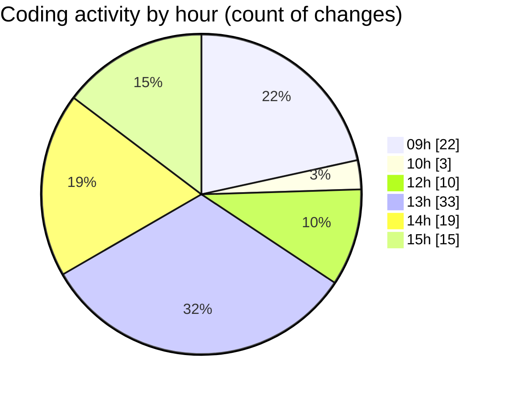

# cda - Activity Summary 

## Overall Statistics

| Stat                   | Value                                                             |
| ---------------------- | ----------------------------------------------------------------- |
| **Lines Added** (➕)   | 33311                                          |
| **Lines Removed** (➖) | 2188                                        |
| **Net Change** (↕)    | 31123                |
| **Active Time** (⌚)   | 151 minutes |

## Modified Files
- **system.ts** (+401, -802)
- **AdminService.ts** (+768, -19)
- **MockSystemService.ts** (+0, -97)
- **MockAdminService.ts** (+284, -154)
- **AdminService.test.ts** (+910, -32)
- **SystemService.test.ts** (+938, -876)
- **admin-mutations.ts** (+1933, -182)
- **index.ts** (+163, -0)
- **resolvers-types.ts** (+23696, -1)
- **clear-view-types.js** (+2282, -1)
- **clear-view-mutations.ts** (+1170, -22)
- **SystemService.ts** (+422, -2)
- **ClearView.ts** (+344, -0)

## Visualizations

### By File Type (Lines Changed)

### By Hour (Estimated Activity Count)

> **Last Updated:** 27/06/2025, 15:17:43