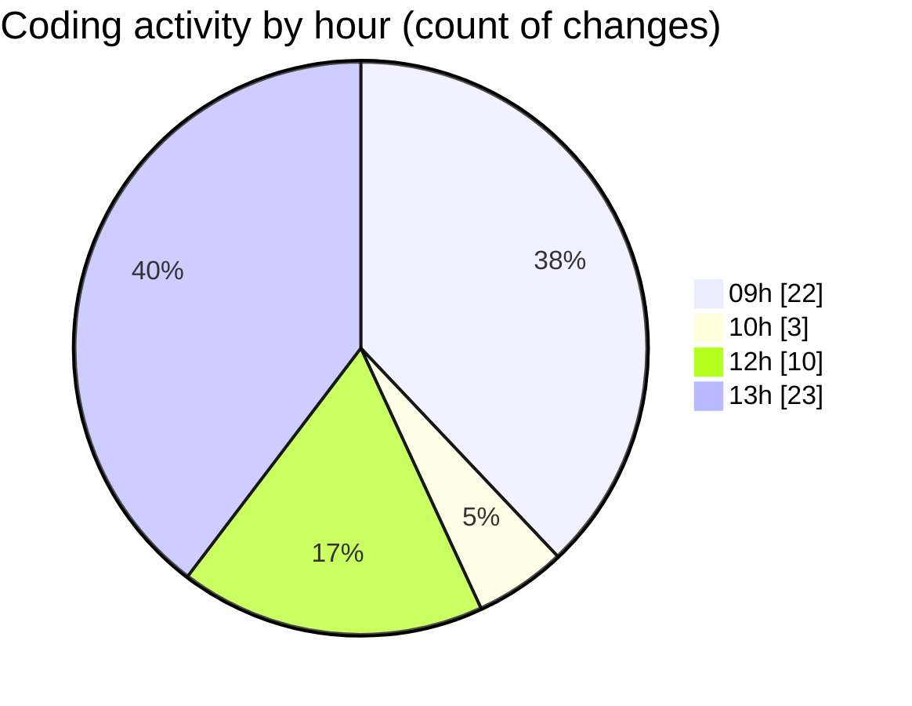

# cda - Activity Summary 

## Overall Statistics

| Stat                   | Value                                                             |
| ---------------------- | ----------------------------------------------------------------- |
| **Lines Added** (➕)   | 15328                                          |
| **Lines Removed** (➖) | 1920                                        |
| **Net Change** (↕)    | 13408                |
| **Active Time** (⌚)   | 85 minutes |

## Modified Files
- **system.ts** (+401, -802)
- **AdminService.ts** (+0, -1)
- **MockSystemService.ts** (+0, -97)
- **MockAdminService.ts** (+284, -154)
- **AdminService.test.ts** (+88, -32)
- **SystemService.test.ts** (+0, -729)
- **admin-mutations.ts** (+1487, -105)
- **index.ts** (+81, -0)
- **resolvers-types.ts** (+11847, -0)
- **clear-view-types.js** (+1140, -0)

## Visualizations

### By File Type (Lines Changed)

### By Hour (Estimated Activity Count)

> **Last Updated:** 27/06/2025, 13:45:30