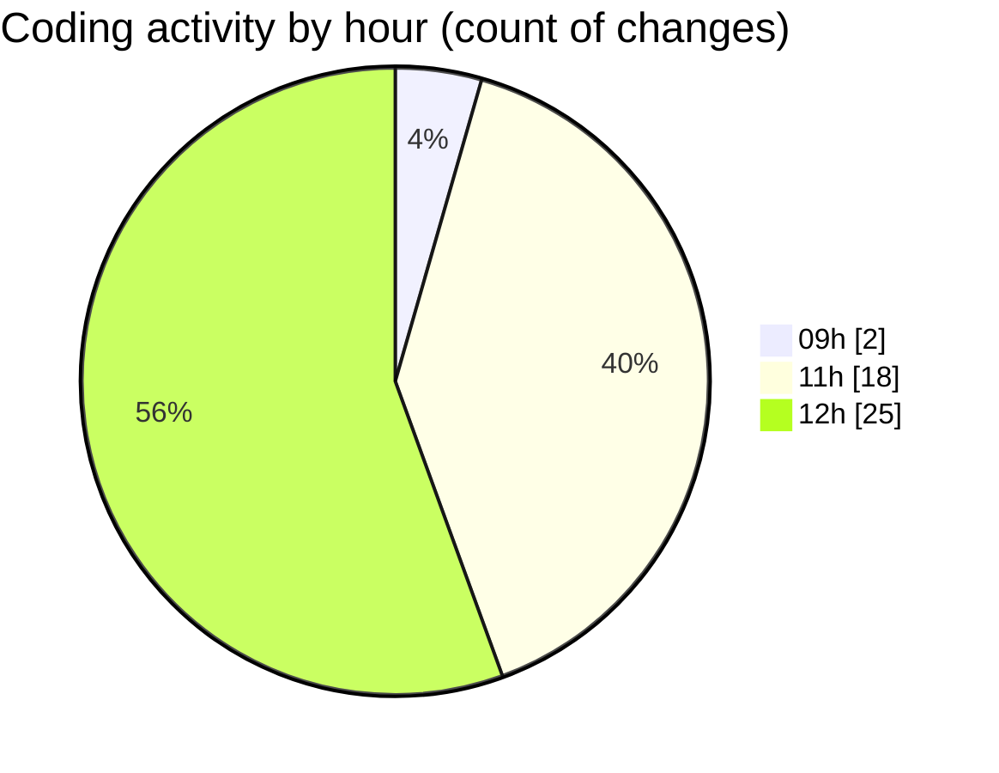

# cda - Activity Summary 

## Overall Statistics

| Stat                   | Value                                                             |
| ---------------------- | ----------------------------------------------------------------- |
| **Lines Added** (➕)   | 26086                                          |
| **Lines Removed** (➖) | 852                                        |
| **Net Change** (↕)    | 25234                |
| **Active Time** (⌚)   | 77 minutes |

## Modified Files
- **App.tsx** (+234, -4)
- **clear-view-queries.js** (+505, -6)
- **resolvers-types.ts** (+11848, -0)
- **AllocateMonth.test.tsx** (+34, -0)
- **MonthlyViewRow.scss** (+140, -0)
- **helpers.test.ts** (+103, -0)
- **gql.ts** (+136, -0)
- **Home.tsx** (+415, -0)
- **queries.ts** (+530, -0)
- **clear-view-queries.ts** (+775, -76)
- **SystemService.test.ts** (+796, -4)
- **AdminService.test.ts** (+1584, -762)
- **InitiativesFiltersAndTable.tsx** (+256, -0)
- **gql.ts** (+724, -0)
- **graphql.ts** (+7430, -0)
- **App.tsx** (+576, -0)

## Visualizations

### By File Type (Lines Changed)

### By Hour (Estimated Activity Count)

> **Last Updated:** 30/06/2025, 12:55:23