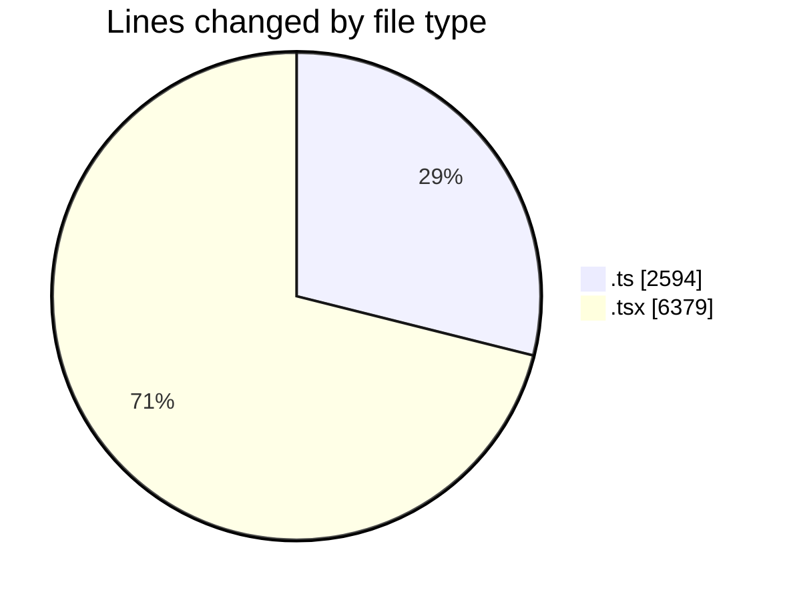
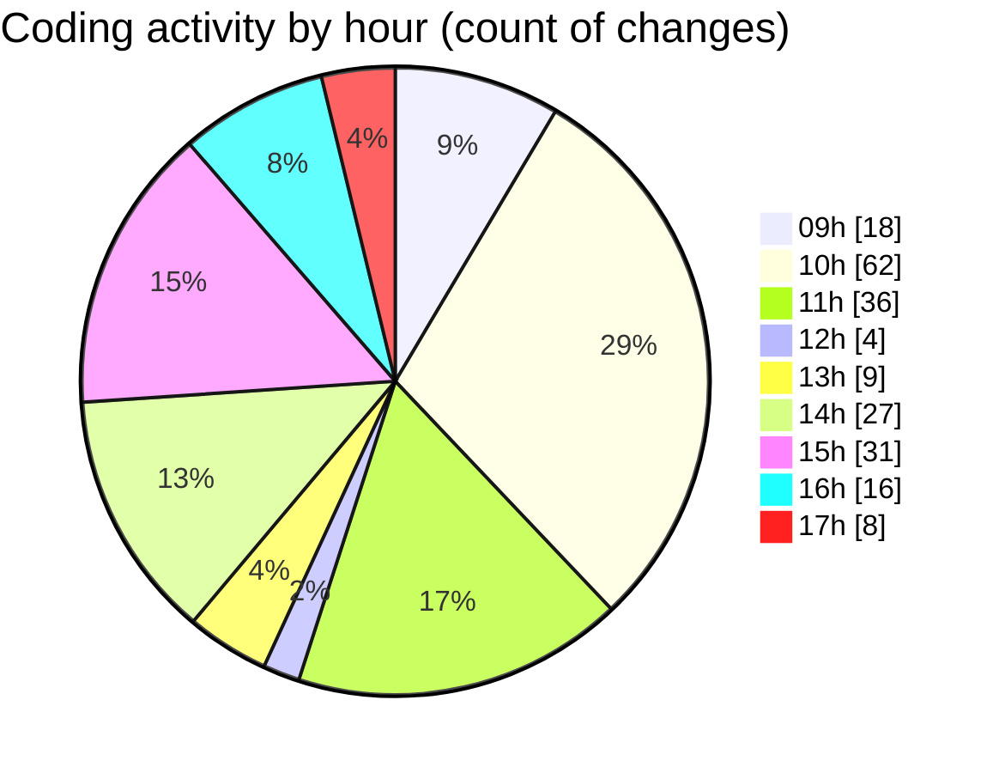

# cda - Activity Summary 

## Overall Statistics

| Stat                   | Value                                                             |
| ---------------------- | ----------------------------------------------------------------- |
| **Lines Added** (➕)   | 7794                                          |
| **Lines Removed** (➖) | 1179                                        |
| **Net Change** (↕)    | 6615                |
| **Active Time** (⌚)   | 289 minutes |

## Modified Files
- **index.ts** (+3, -0)
- **index.ts** (+3, -0)
- **HelperAdmin.tsx** (+467, -2)
- **index.ts** (+3, -0)
- **AdminHelper.tsx** (+995, -540)
- **buildGlossaryPannels.ts** (+356, -45)
- **gql.ts** (+54, -0)
- **ast.d.ts** (+539, -0)
- **buildGlossaryPanels.ts** (+317, -0)
- **GroupMembersView.tsx** (+220, -0)
- **helperPanels.test.ts** (+130, -32)
- **helperPanels.ts** (+635, -0)
- **App.tsx** (+576, -0)
- **InitiativeDetails.tsx** (+776, -6)
- **DetailsToolTip.tsx** (+74, -0)
- **helperPanels.test.ts** (+132, -27)
- **helperPanels.ts** (+318, -0)
- **HelperTextProvider.tsx** (+16, -0)
- **HelperModal.tsx** (+560, -527)
- **DetailsField.tsx** (+257, -0)
- **Panel.tsx** (+34, -0)
- **CreateInitiative.tsx** (+832, -0)
- **PoolEvent.tsx** (+139, -0)
- **PoolPositionAmountsPanel.tsx** (+228, -0)
- **CostActuals.tsx** (+130, -0)

## Visualizations

### By File Type (Lines Changed)

### By Hour (Estimated Activity Count)

> **Last Updated:** 01/07/2025, 17:15:57