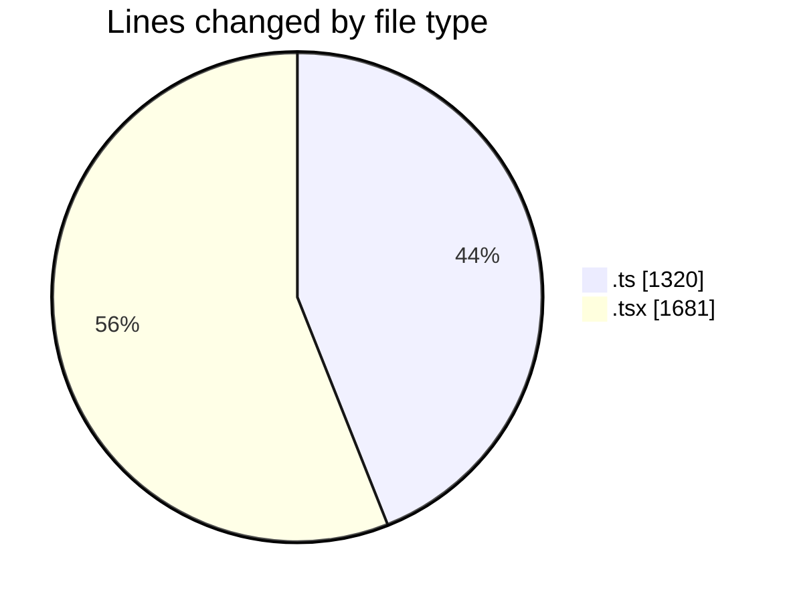
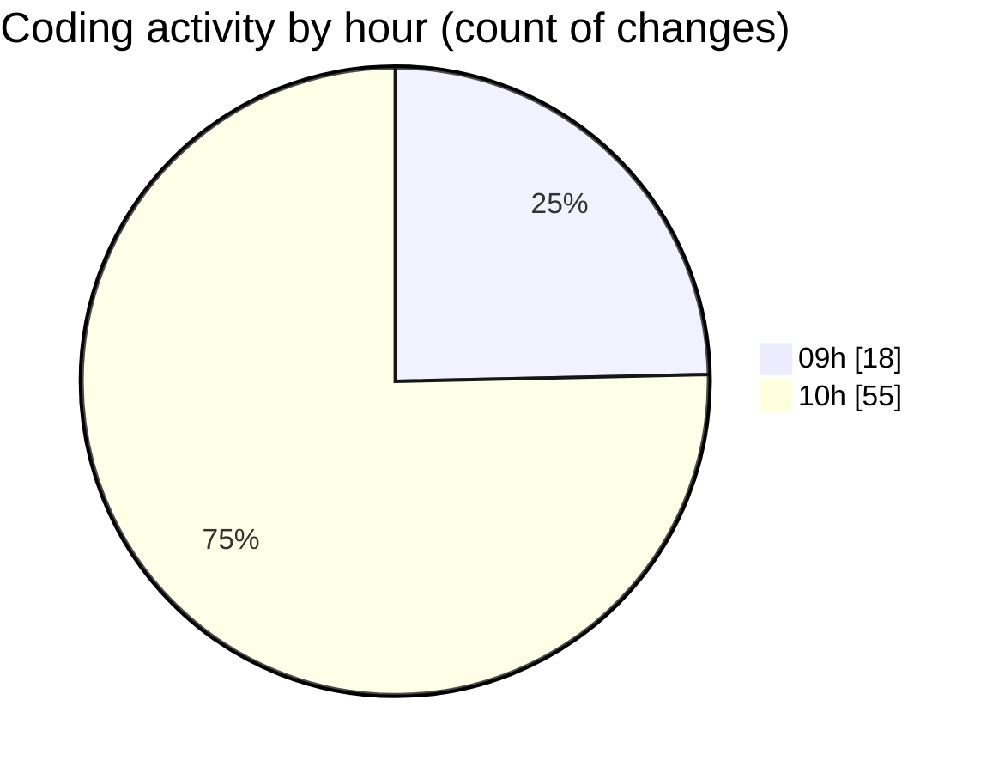

# cda - Activity Summary 

## Overall Statistics

| Stat                   | Value                                                             |
| ---------------------- | ----------------------------------------------------------------- |
| **Lines Added** (➕)   | 2450                                          |
| **Lines Removed** (➖) | 551                                        |
| **Net Change** (↕)    | 1899                |
| **Active Time** (⌚)   | 94 minutes |

## Modified Files
- **index.ts** (+3, -0)
- **index.ts** (+3, -0)
- **HelperAdmin.tsx** (+467, -2)
- **index.ts** (+3, -0)
- **AdminHelper.tsx** (+708, -504)
- **buildGlossaryPannels.ts** (+356, -45)
- **gql.ts** (+54, -0)
- **ast.d.ts** (+539, -0)
- **buildGlossaryPanels.ts** (+317, -0)

## Visualizations

### By File Type (Lines Changed)

### By Hour (Estimated Activity Count)

> **Last Updated:** 01/07/2025, 10:50:25