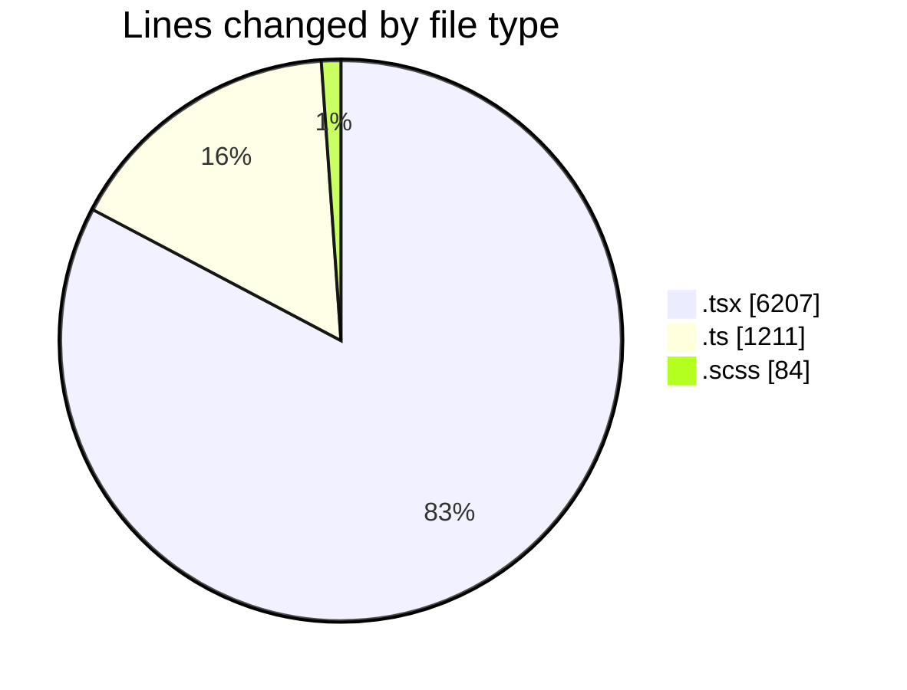
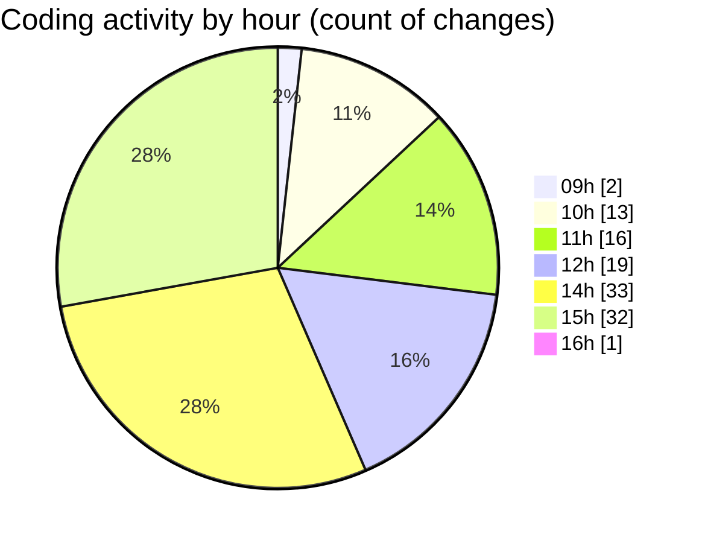

# cda - Activity Summary 

## Overall Statistics

| Stat                   | Value                                                             |
| ---------------------- | ----------------------------------------------------------------- |
| **Lines Added** (➕)   | 6777                                          |
| **Lines Removed** (➖) | 725                                        |
| **Net Change** (↕)    | 6052                |
| **Active Time** (⌚)   | 165 minutes |

## Modified Files
- **App.tsx** (+1152, -1)
- **AdminHelper.tsx** (+482, -269)
- **helperTextTransform.ts** (+273, -102)
- **InitiativeDetails.tsx** (+848, -53)
- **general.ts** (+441, -0)
- **helperText.ts** (+198, -197)
- **DetailsField.tsx** (+267, -10)
- **HelperModal.tsx** (+131, -84)
- **DetailsToolTip.tsx** (+74, -0)
- **CreateInitiative.tsx** (+832, -8)
- **PoolEvent.tsx** (+139, -0)
- **PoolPositionAmountsPanel.tsx** (+228, -0)
- **Panel.tsx** (+34, -0)
- **Panel.scss** (+10, -0)
- **DetailsToolTip.scss** (+73, -1)
- **PoolPosition.tsx** (+613, -0)
- **PoolDetails.tsx** (+515, -0)
- **CostDetails.tsx** (+337, -0)
- **CostActuals.tsx** (+130, -0)

## Visualizations

### By File Type (Lines Changed)

### By Hour (Estimated Activity Count)

> **Last Updated:** 02/07/2025, 16:05:16