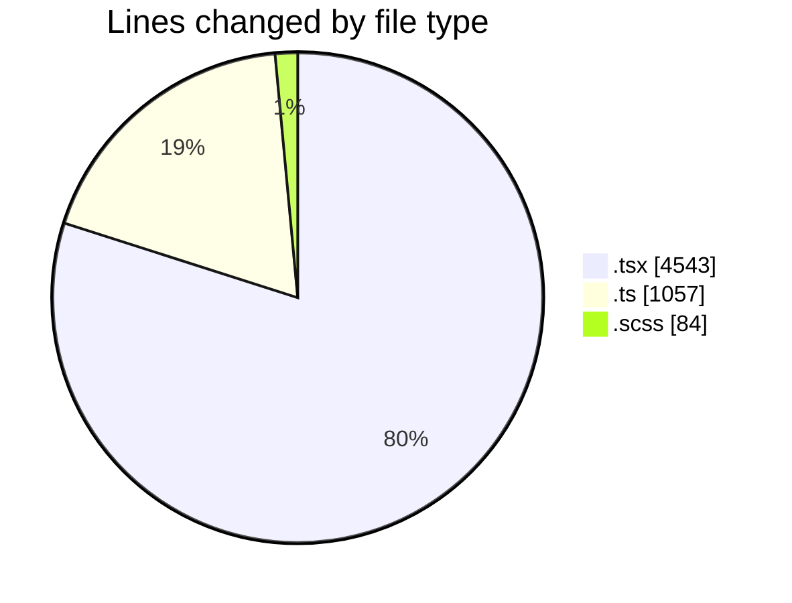
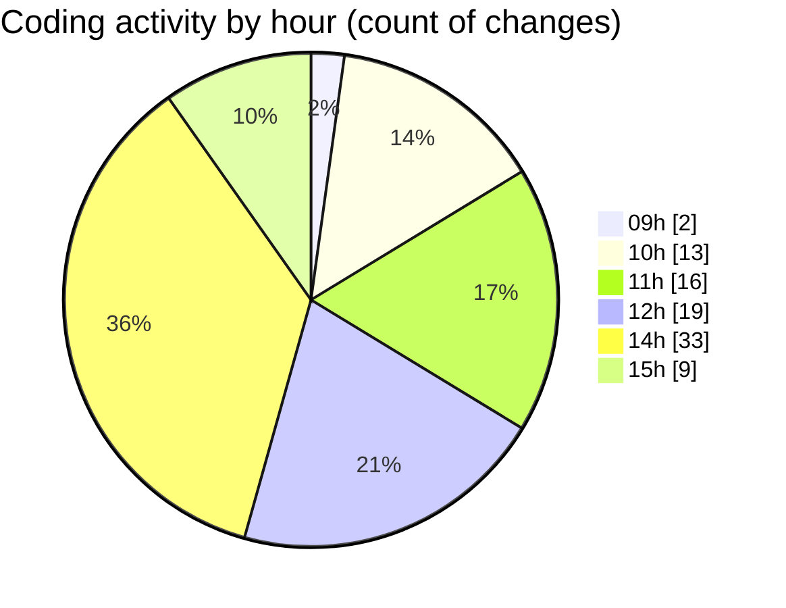

# cda - Activity Summary 

## Overall Statistics

| Stat                   | Value                                                             |
| ---------------------- | ----------------------------------------------------------------- |
| **Lines Added** (➕)   | 5131                                          |
| **Lines Removed** (➖) | 553                                        |
| **Net Change** (↕)    | 4578                |
| **Active Time** (⌚)   | 138 minutes |

## Modified Files
- **App.tsx** (+1152, -1)
- **AdminHelper.tsx** (+482, -269)
- **helperTextTransform.ts** (+260, -102)
- **InitiativeDetails.tsx** (+810, -25)
- **general.ts** (+441, -0)
- **helperText.ts** (+198, -56)
- **DetailsField.tsx** (+267, -7)
- **HelperModal.tsx** (+131, -84)
- **DetailsToolTip.tsx** (+74, -0)
- **CreateInitiative.tsx** (+832, -8)
- **PoolEvent.tsx** (+139, -0)
- **PoolPositionAmountsPanel.tsx** (+228, -0)
- **Panel.tsx** (+34, -0)
- **Panel.scss** (+10, -0)
- **DetailsToolTip.scss** (+73, -1)

## Visualizations

### By File Type (Lines Changed)

### By Hour (Estimated Activity Count)

> **Last Updated:** 02/07/2025, 15:15:16