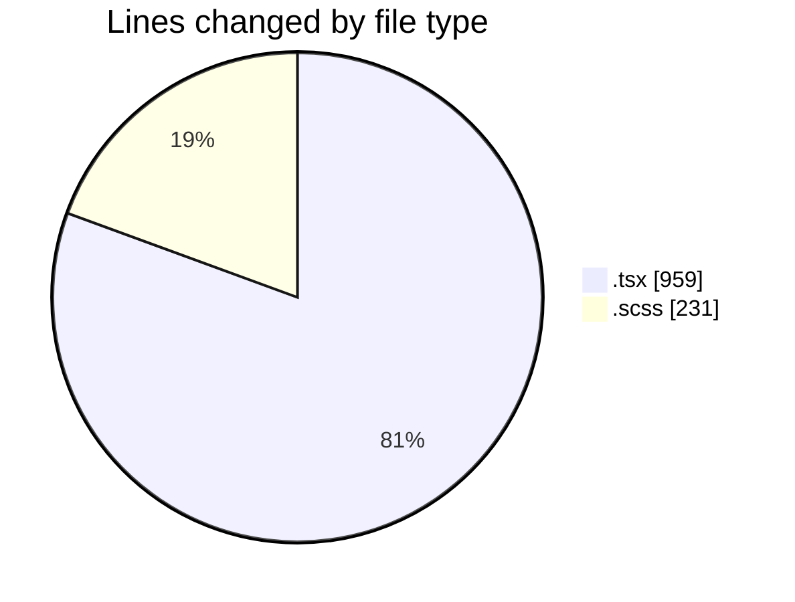

# cda - Activity Summary 

## Overall Statistics

| Stat                   | Value                                                             |
| ---------------------- | ----------------------------------------------------------------- |
| **Lines Added** (➕)   | 1148                                          |
| **Lines Removed** (➖) | 42                                        |
| **Net Change** (↕)    | 1106                |
| **Active Time** (⌚)   | 50 minutes |

## Modified Files
- **PoolEvents.tsx** (+87, -0)
- **InitiativeDetails.tsx** (+818, -17)
- **Panel.tsx** (+34, -3)
- **DetailsGrid.scss** (+81, -11)
- **DetailsToolTip.scss** (+76, -10)
- **DetailsField.scss** (+52, -1)

## Visualizations

### By File Type (Lines Changed)

### By Hour (Estimated Activity Count)

> **Last Updated:** 03/07/2025, 11:22:49