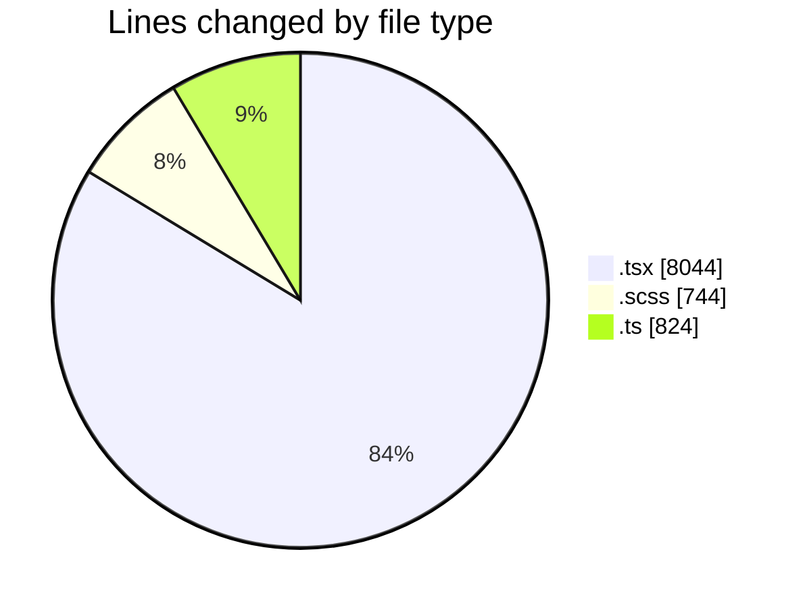
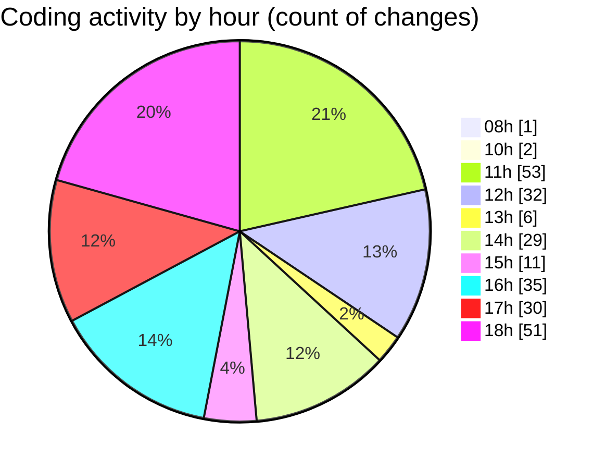

# cda - Activity Summary 

## Overall Statistics

| Stat                   | Value                                                             |
| ---------------------- | ----------------------------------------------------------------- |
| **Lines Added** (➕)   | 9274                                          |
| **Lines Removed** (➖) | 338                                        |
| **Net Change** (↕)    | 8936                |
| **Active Time** (⌚)   | 353 minutes |

## Modified Files
- **PoolEvents.tsx** (+87, -0)
- **InitiativeDetails.tsx** (+1636, -52)
- **Panel.tsx** (+34, -11)
- **DetailsGrid.scss** (+161, -11)
- **DetailsToolTip.scss** (+144, -10)
- **DetailsField.scss** (+126, -33)
- **Panel.scss** (+10, -0)
- **PoolDetails.tsx** (+1080, -16)
- **CostActuals.tsx** (+158, -10)
- **InitiativesFiltersAndTable.tsx** (+269, -13)
- **Filters.tsx** (+145, -9)
- **FilterField.tsx** (+194, -2)
- **Initiatives.tsx** (+132, -0)
- **InitiativeDetails.test.tsx** (+207, -0)
- **InitiativeGroupDetails.tsx** (+420, -0)
- **HelperModal.tsx** (+94, -0)
- **CostDetails.tsx** (+341, -3)
- **helperTextTransform.ts** (+185, -7)
- **types.ts** (+137, -6)
- **ReinvestmentDetail.tsx** (+594, -2)
- **CreateInitiative.tsx** (+890, -53)
- **PoolEvent.tsx** (+161, -1)
- **InitiativeHeadcountForecasts.tsx** (+129, -4)
- **InitiativeHeadcountForecastsTable.tsx** (+198, -29)
- **CommonTable.scss** (+90, -0)
- **PoolPosition.tsx** (+617, -0)
- **PositionDetails.tsx** (+104, -0)
- **helperPanels.ts** (+364, -20)
- **PoolPosition.scss** (+117, -42)
- **EftTotals.tsx** (+132, -3)
- **AdminHelper.tsx** (+213, -1)
- **helperPanels.test.ts** (+105, -0)

## Visualizations

### By File Type (Lines Changed)

### By Hour (Estimated Activity Count)

> **Last Updated:** 03/07/2025, 18:57:52