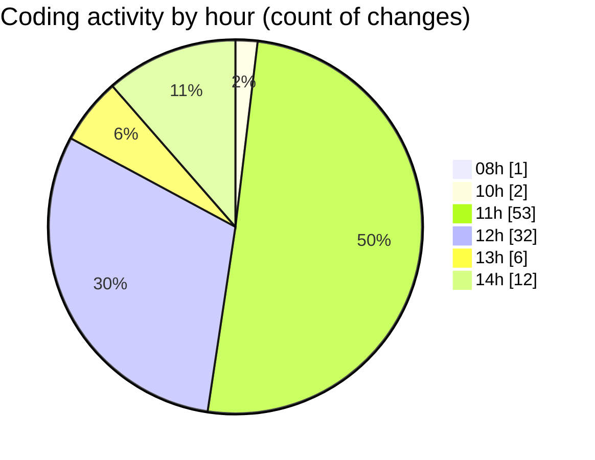

# cda - Activity Summary 

## Overall Statistics

| Stat                   | Value                                                             |
| ---------------------- | ----------------------------------------------------------------- |
| **Lines Added** (➕)   | 4326                                          |
| **Lines Removed** (➖) | 114                                        |
| **Net Change** (↕)    | 4212                |
| **Active Time** (⌚)   | 144 minutes |

## Modified Files
- **PoolEvents.tsx** (+87, -0)
- **InitiativeDetails.tsx** (+825, -29)
- **Panel.tsx** (+34, -11)
- **DetailsGrid.scss** (+81, -11)
- **DetailsToolTip.scss** (+77, -10)
- **DetailsField.scss** (+52, -1)
- **Panel.scss** (+10, -0)
- **PoolDetails.tsx** (+1062, -8)
- **CostActuals.tsx** (+158, -10)
- **InitiativesFiltersAndTable.tsx** (+269, -13)
- **Filters.tsx** (+145, -9)
- **FilterField.tsx** (+194, -2)
- **Initiatives.tsx** (+132, -0)
- **InitiativeDetails.test.tsx** (+207, -0)
- **InitiativeGroupDetails.tsx** (+420, -0)
- **HelperModal.tsx** (+47, -0)
- **CostDetails.tsx** (+341, -3)
- **helperTextTransform.ts** (+185, -7)

## Visualizations

### By File Type (Lines Changed)

### By Hour (Estimated Activity Count)

> **Last Updated:** 03/07/2025, 14:52:52