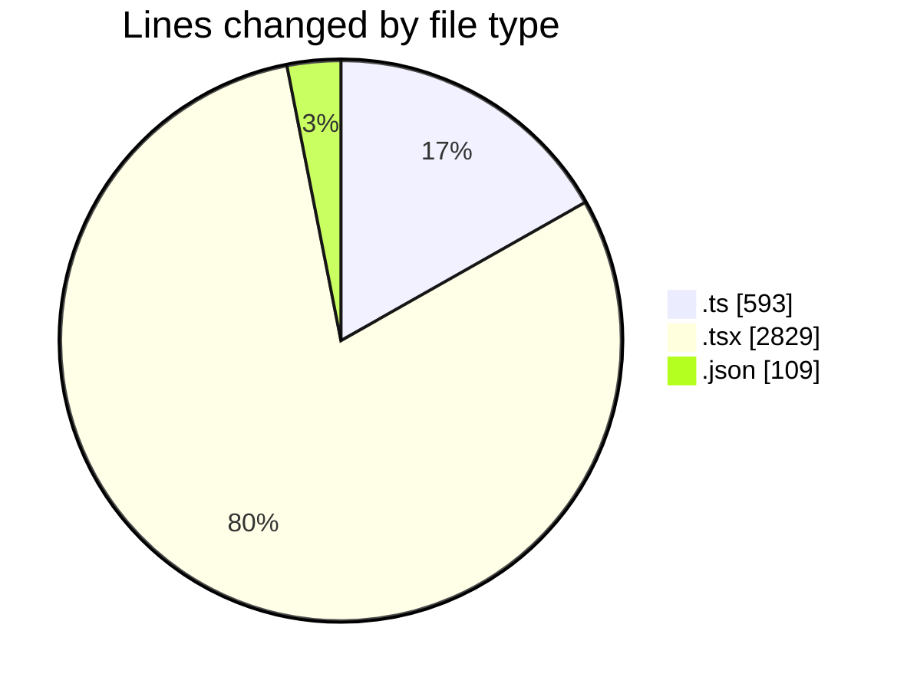
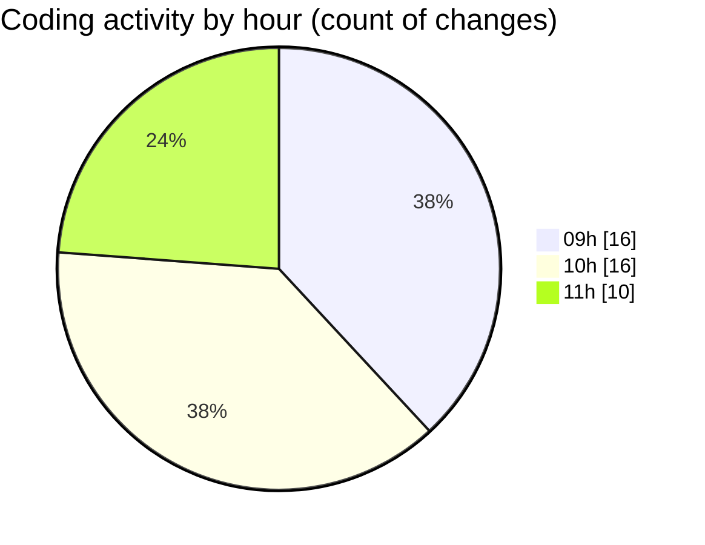

# cda - Activity Summary 

## Overall Statistics

| Stat                   | Value                                                             |
| ---------------------- | ----------------------------------------------------------------- |
| **Lines Added** (➕)   | 3090                                          |
| **Lines Removed** (➖) | 441                                        |
| **Net Change** (↕)    | 2649                |
| **Active Time** (⌚)   | 50 minutes |

## Modified Files
- **helperPanels.ts** (+324, -26)
- **App.tsx** (+1152, -1)
- **helperTextTransform.ts** (+6, -158)
- **AdminHelper.tsx** (+444, -229)
- **CostDetails.tsx** (+338, -0)
- **helperPanels.test.ts** (+6, -2)
- **PoolDetails.tsx** (+564, -11)
- **settings.json** (+107, -2)
- **helperTex.test.ts** (+71, -0)
- **HelperSection.tsx** (+78, -12)

## Visualizations

### By File Type (Lines Changed)

### By Hour (Estimated Activity Count)

> **Last Updated:** 04/07/2025, 11:24:17