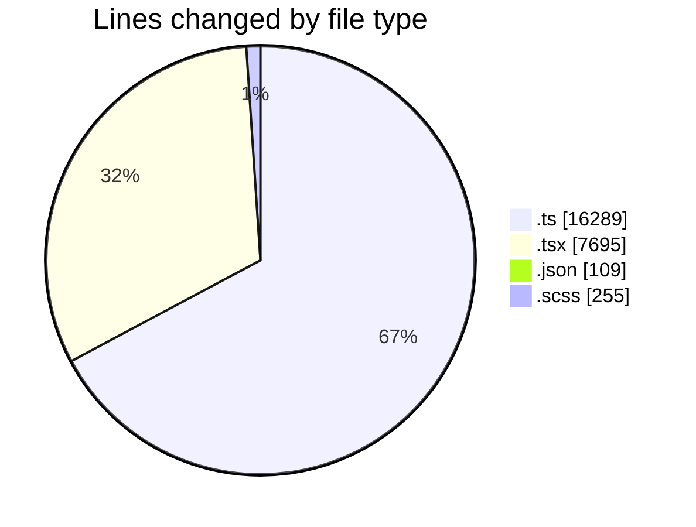
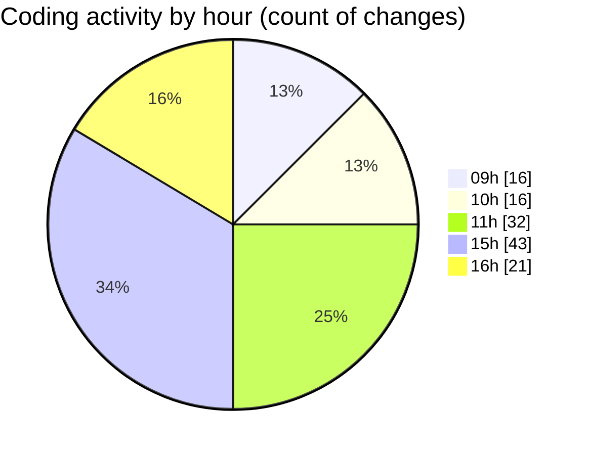

# cda - Activity Summary 

## Overall Statistics

| Stat                   | Value                                                             |
| ---------------------- | ----------------------------------------------------------------- |
| **Lines Added** (➕)   | 23782                                          |
| **Lines Removed** (➖) | 566                                        |
| **Net Change** (↕)    | 23216                |
| **Active Time** (⌚)   | 153 minutes |

## Modified Files
- **helperPanels.ts** (+324, -28)
- **App.tsx** (+1729, -2)
- **helperTextTransform.ts** (+6, -158)
- **AdminHelper.tsx** (+662, -235)
- **CostDetails.tsx** (+338, -0)
- **helperPanels.test.ts** (+6, -2)
- **PoolDetails.tsx** (+1113, -17)
- **settings.json** (+107, -2)
- **helperTex.test.ts** (+71, -0)
- **HelperSection.tsx** (+89, -25)
- **DetailsToolTip.scss** (+91, -24)
- **PoolPosition.scss** (+75, -0)
- **DetailsField.scss** (+57, -8)
- **ReinvestmentDetail.tsx** (+594, -4)
- **PoolPositionAmountsPanel.tsx** (+263, -16)
- **UserProvider.tsx** (+192, -0)
- **InitiativeHeadcountForecastsTable.tsx** (+169, -6)
- **PositionDetails.tsx** (+104, -8)
- **CostActuals.tsx** (+154, -7)
- **EftTotals.tsx** (+129, -8)
- **PoolEvent.tsx** (+160, -7)
- **InitiativeDetails.tsx** (+788, -6)
- **mockData.ts** (+15693, -1)
- **CreateInitiative.test.tsx** (+367, -0)
- **ReinvestmentDetail.test.tsx** (+443, -2)
- **EftTotals.test.tsx** (+58, -0)

## Visualizations

### By File Type (Lines Changed)

### By Hour (Estimated Activity Count)

> **Last Updated:** 04/07/2025, 16:42:28