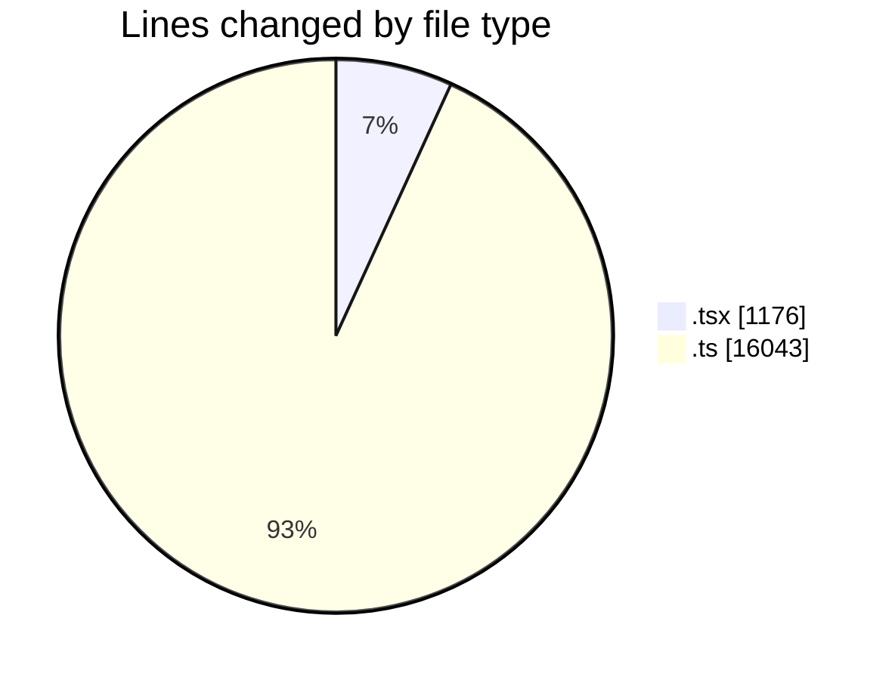
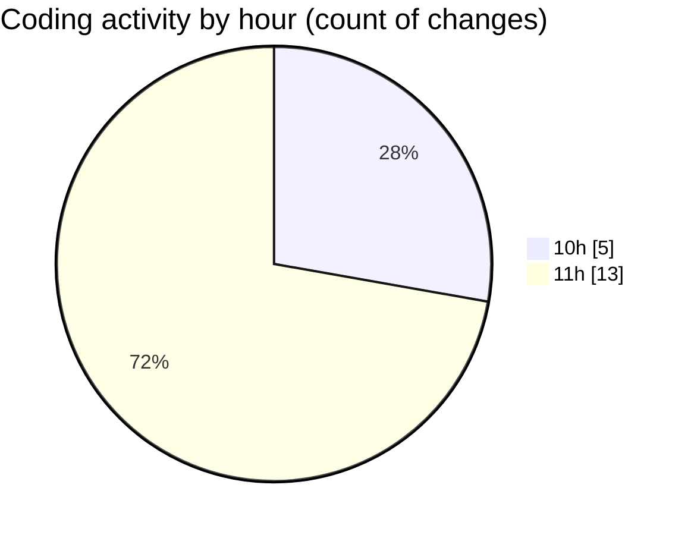

# cda - Activity Summary 

## Overall Statistics

| Stat                   | Value                                                             |
| ---------------------- | ----------------------------------------------------------------- |
| **Lines Added** (➕)   | 17169                                          |
| **Lines Removed** (➖) | 50                                        |
| **Net Change** (↕)    | 17119                |
| **Active Time** (⌚)   | 26 minutes |

## Modified Files
- **App.tsx** (+576, -0)
- **ReinvestmentDetail.test.tsx** (+441, -0)
- **helperPanels.ts** (+320, -0)
- **helperText.ts** (+26, -2)
- **mockData.ts** (+15693, -2)
- **EftTotals.test.tsx** (+113, -46)

## Visualizations

### By File Type (Lines Changed)

### By Hour (Estimated Activity Count)

> **Last Updated:** 07/07/2025, 11:10:19