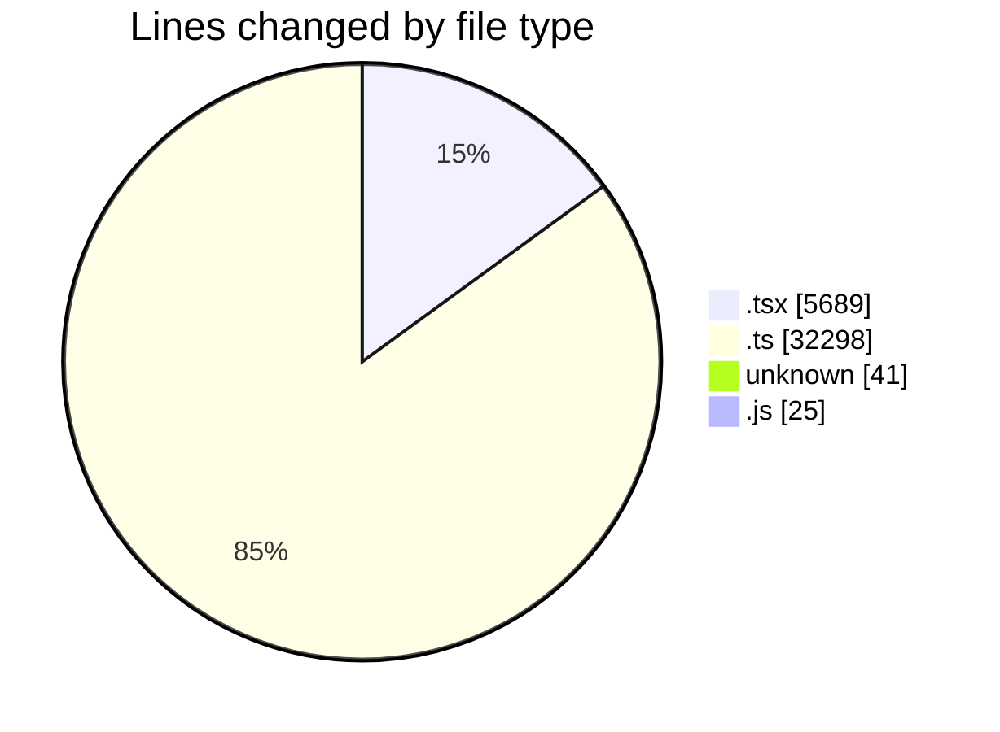
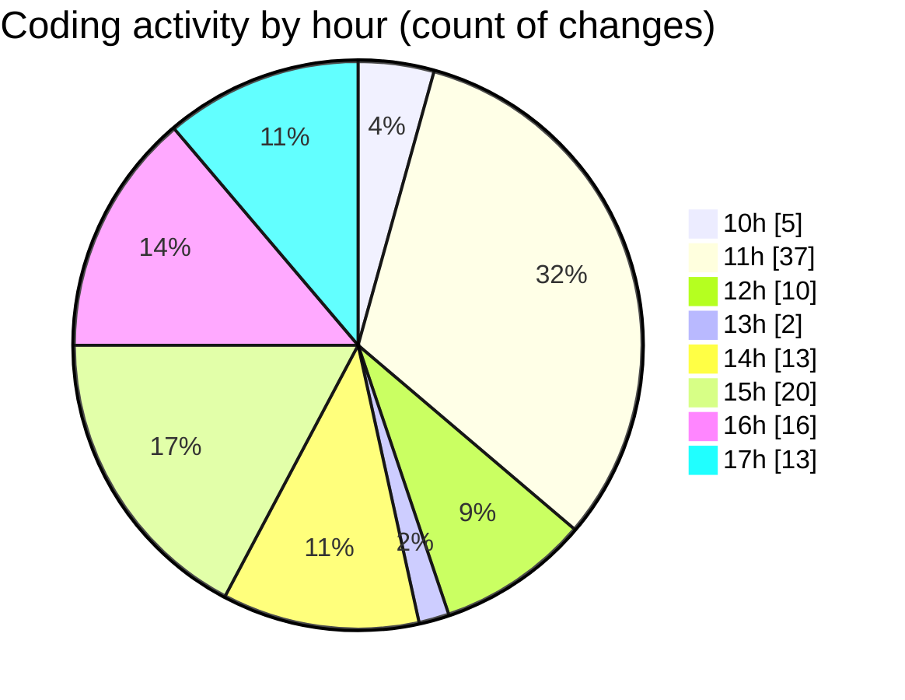

# cda - Activity Summary 

## Overall Statistics

| Stat                   | Value                                                             |
| ---------------------- | ----------------------------------------------------------------- |
| **Lines Added** (➕)   | 37750                                          |
| **Lines Removed** (➖) | 303                                        |
| **Net Change** (↕)    | 37447                |
| **Active Time** (⌚)   | 161 minutes |

## Modified Files
- **App.tsx** (+1165, -13)
- **ReinvestmentDetail.test.tsx** (+441, -0)
- **helperPanels.ts** (+320, -0)
- **helperText.ts** (+26, -2)
- **mockData.ts** (+31385, -3)
- **EftTotals.test.tsx** (+124, -46)
- **InitiativeHeadcountForecast.test.tsx** (+228, -114)
- **CreateInitiative.test.tsx** (+801, -73)
- **CreateInitiative.tsx** (+1689, -13)
- **Pools.tsx** (+158, -17)
- **pools.ts** (+431, -0)
- **PoolPositionAmountsPanel.tsx** (+266, -19)
- **PoolsTable.tsx** (+148, -0)
- **PoolEvent.tsx** (+153, -0)
- **.env** (+41, -0)
- **20250707154656-update-data-helper-text-table.js** (+25, -0)
- **types.ts** (+131, -0)
- **AdminHelper.tsx** (+218, -3)

## Visualizations

### By File Type (Lines Changed)

### By Hour (Estimated Activity Count)

> **Last Updated:** 07/07/2025, 17:18:51