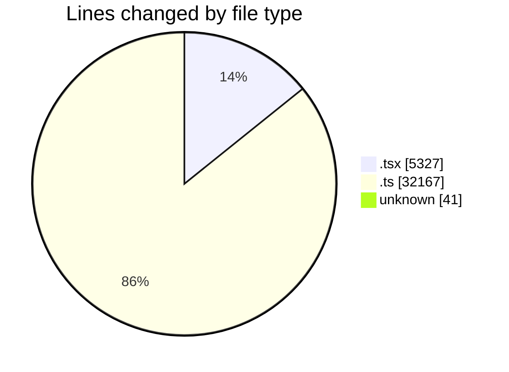
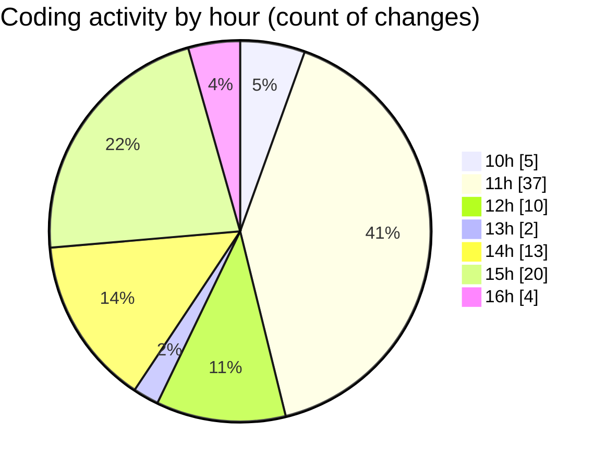

# cda - Activity Summary 

## Overall Statistics

| Stat                   | Value                                                             |
| ---------------------- | ----------------------------------------------------------------- |
| **Lines Added** (➕)   | 37267                                          |
| **Lines Removed** (➖) | 268                                        |
| **Net Change** (↕)    | 36999                |
| **Active Time** (⌚)   | 121 minutes |

## Modified Files
- **App.tsx** (+1144, -1)
- **ReinvestmentDetail.test.tsx** (+441, -0)
- **helperPanels.ts** (+320, -0)
- **helperText.ts** (+26, -2)
- **mockData.ts** (+31385, -3)
- **EftTotals.test.tsx** (+124, -46)
- **InitiativeHeadcountForecast.test.tsx** (+228, -114)
- **CreateInitiative.test.tsx** (+778, -73)
- **CreateInitiative.tsx** (+1689, -13)
- **Pools.tsx** (+145, -16)
- **pools.ts** (+431, -0)
- **PoolPositionAmountsPanel.tsx** (+228, -0)
- **PoolsTable.tsx** (+148, -0)
- **PoolEvent.tsx** (+139, -0)
- **.env** (+41, -0)

## Visualizations

### By File Type (Lines Changed)

### By Hour (Estimated Activity Count)

> **Last Updated:** 07/07/2025, 16:18:51