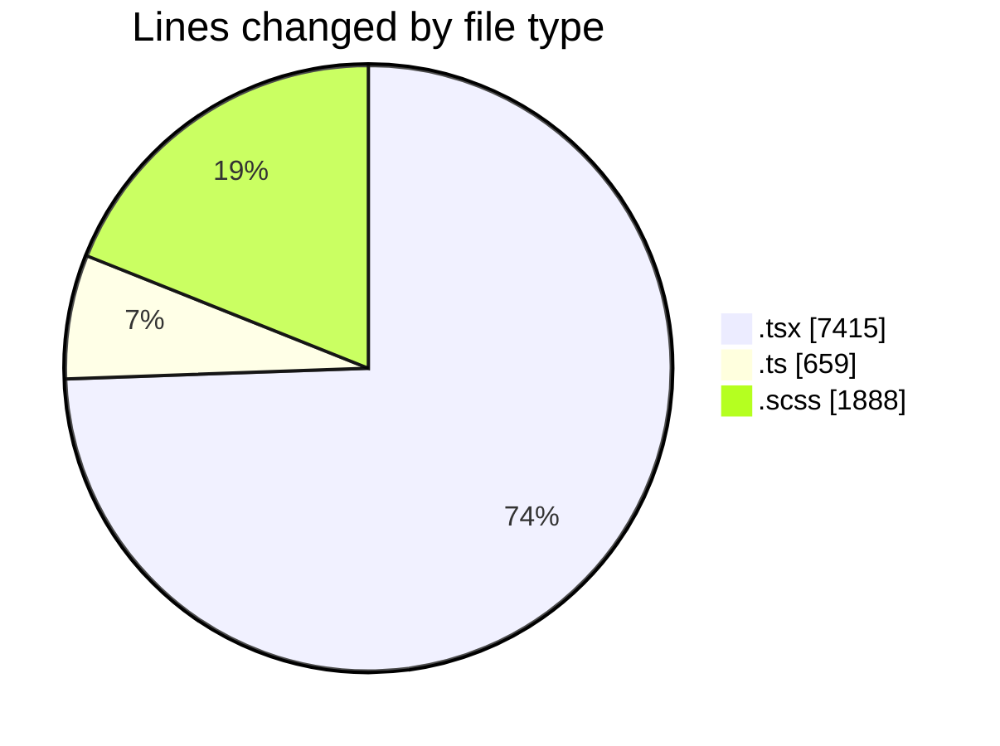
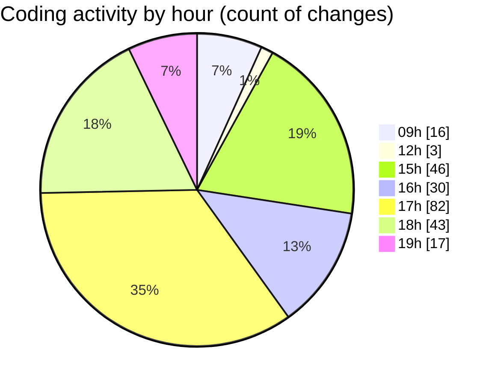

# cda - Activity Summary 

## Overall Statistics

| Stat                   | Value                                                             |
| ---------------------- | ----------------------------------------------------------------- |
| **Lines Added** (➕)   | 9400                                          |
| **Lines Removed** (➖) | 562                                        |
| **Net Change** (↕)    | 8838                |
| **Active Time** (⌚)   | 326 minutes |

## Modified Files
- **App.tsx** (+603, -28)
- **PoolPositionAmountsPanel.tsx** (+529, -41)
- **AdminHelper.tsx** (+285, -40)
- **RouteWrapper.tsx** (+215, -1)
- **helperPanels.ts** (+647, -12)
- **DetailsToolTip.scss** (+293, -106)
- **EditableTextInput.scss** (+46, -10)
- **CommonTable.scss** (+90, -1)
- **EditableTextInput.tsx** (+137, -9)
- **Panel.tsx** (+69, -0)
- **UserProvider.tsx** (+196, -2)
- **InitiativeHeadcountForecastsTable.tsx** (+320, -9)
- **PoolDetails.tsx** (+1075, -12)
- **InitiativeDetails.tsx** (+782, -6)
- **PoolEvent.tsx** (+311, -0)
- **EftTotals.tsx** (+121, -9)
- **CostActuals.tsx** (+437, -3)
- **PositionDetails.tsx** (+96, -3)
- **EftTotals.test.tsx** (+78, -0)
- **HelperSection.tsx** (+129, -5)
- **PoolEvent.scss** (+199, -52)
- **HelperModal.scss** (+184, -30)
- **HelperModal.tsx** (+145, -2)
- **DetailsField.scss** (+117, -33)
- **Panel.scss** (+78, -12)
- **PoolPosition.scss** (+176, -39)
- **PoolPositionAmountsPanel.scss** (+155, -97)
- **DetailsGrid.scss** (+170, -0)
- **DetailsToolTip.tsx** (+74, -0)
- **CreateInitiative.tsx** (+837, -0)
- **CreateInitiative.test.tsx** (+365, -0)
- **ReinvestmentDetail.test.tsx** (+441, -0)

## Visualizations

### By File Type (Lines Changed)

### By Hour (Estimated Activity Count)

> **Last Updated:** 08/07/2025, 19:48:21