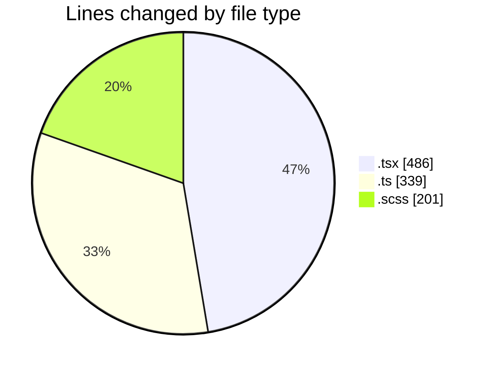
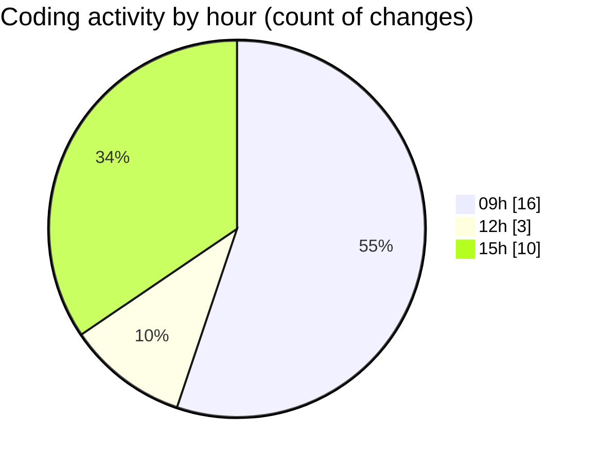

# cda - Activity Summary 

## Overall Statistics

| Stat                   | Value                                                             |
| ---------------------- | ----------------------------------------------------------------- |
| **Lines Added** (➕)   | 935                                          |
| **Lines Removed** (➖) | 91                                        |
| **Net Change** (↕)    | 844                |
| **Active Time** (⌚)   | 43 minutes |

## Modified Files
- **App.tsx** (+27, -28)
- **PoolPositionAmountsPanel.tsx** (+38, -38)
- **AdminHelper.tsx** (+1, -1)
- **RouteWrapper.tsx** (+215, -1)
- **helperPanels.ts** (+327, -12)
- **DetailsToolTip.scss** (+67, -1)
- **EditableTextInput.scss** (+39, -3)
- **CommonTable.scss** (+90, -1)
- **EditableTextInput.tsx** (+131, -6)

## Visualizations

### By File Type (Lines Changed)

### By Hour (Estimated Activity Count)

> **Last Updated:** 08/07/2025, 15:15:04