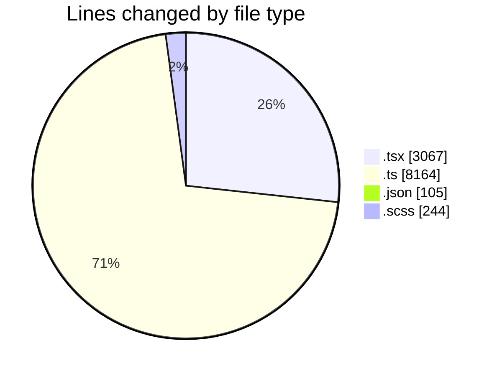
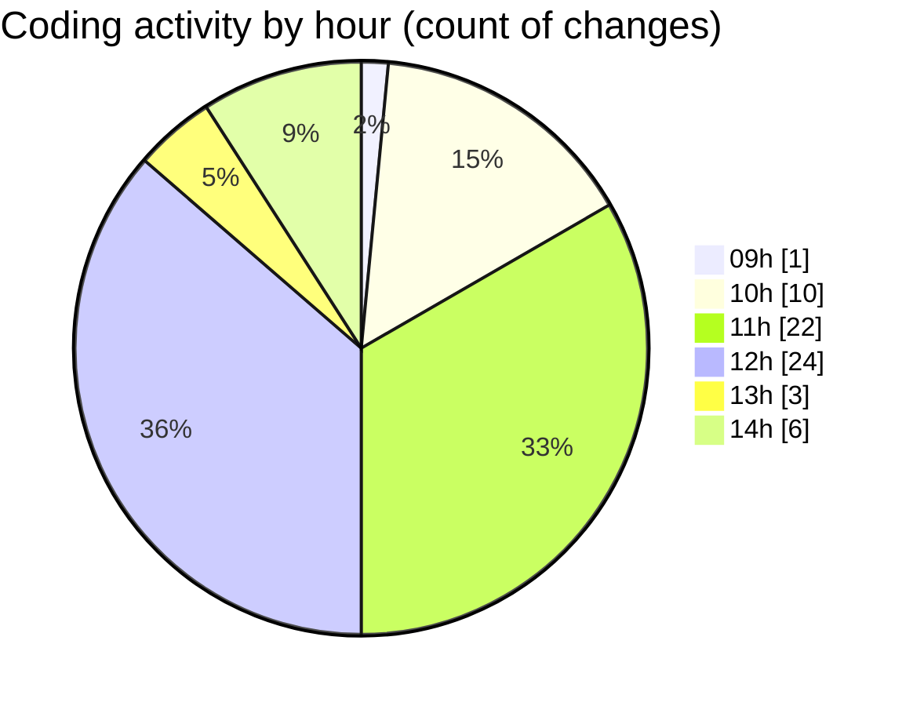

# cda - Activity Summary 

## Overall Statistics

| Stat                   | Value                                                             |
| ---------------------- | ----------------------------------------------------------------- |
| **Lines Added** (➕)   | 11458                                          |
| **Lines Removed** (➖) | 122                                        |
| **Net Change** (↕)    | 11336                |
| **Active Time** (⌚)   | 88 minutes |

## Modified Files
- **PoolPosition.tsx** (+617, -0)
- **AdminHelper.tsx** (+247, -21)
- **HelperSection.tsx** (+60, -0)
- **helperPanels.ts** (+369, -36)
- **ReinvestmentDetail.test.tsx** (+441, -0)
- **CreateInitiative.test.tsx** (+365, -0)
- **graphql.ts** (+7759, -0)
- **settings.json** (+105, -0)
- **RoleDetails.tsx** (+78, -0)
- **DetailsField.tsx** (+275, -14)
- **Filters.tsx** (+136, -0)
- **App.tsx** (+576, -0)
- **EditableTextInput.tsx** (+131, -11)
- **EditableTextInput.scss** (+38, -2)
- **AdminHelper.scss** (+19, -6)
- **HelperModal.scss** (+65, -14)
- **CostActualsTable.tsx** (+67, -0)
- **DetailsGrid.scss** (+85, -15)
- **Panel.tsx** (+25, -3)

## Visualizations

### By File Type (Lines Changed)

### By Hour (Estimated Activity Count)

> **Last Updated:** 09/07/2025, 14:55:09